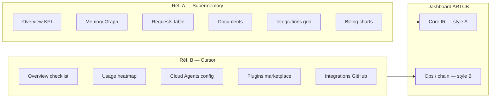
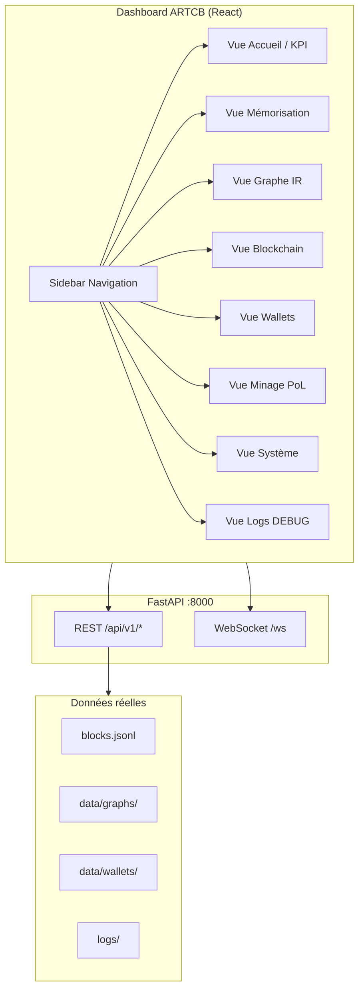
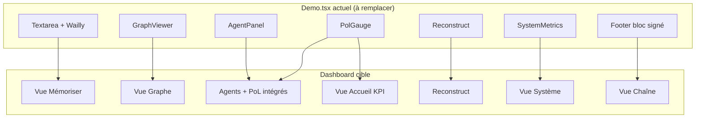
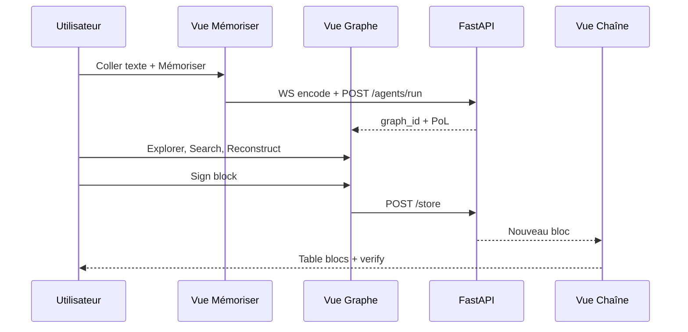

# CAHIER DES CHARGES — Dashboard ARTCB v1.2

**Horodatage :** 2026-07-07T03:55:00Z  
**Statut :** **EN ATTENTE VALIDATION UTILISATEUR** — analyse 50 captures faite, pas de code sans GO explicite  
**Branche spec :** `cursor/dashboard-spec-1fce` (≠ `main`, **pas de merge sans ordre**)  
**Branche captures :** `cursor/dashboard-captures-1fce` — `8edfa3b` — **50 PNG sur GitHub** ✅  
**Références analysées :** Supermemory.ai (`console.supermemory.ai`) + Cursor.com (`cursor.com/dashboard`)

---

## 0. Décision de cap (à valider)

| Avant (CDC §9.3) | Après (demande utilisateur 2026-07-07) |
|------------------|----------------------------------------|
| « Pas de dashboard administratif » — parcours narratif 60 s | **Vrai dashboard** remplaçant `Demo.tsx` |
| 1 page linéaire hackathon | Console multi-vues (monitoring, chain, wallets, minage, graphe) |

**⚠️ Contradiction documentaire :** le CDC §9.3 dit éviter un panel de stats. Ce cahier propose un **dashboard opérationnel** (pas un mock) aligné sur l’API réelle. Validation requise avant code.

---

## 1. Objectif produit

Remplacer la démo hackathon actuelle (`frontend/src/pages/Demo.tsx`) par un **dashboard ARTCB** professionnel qui :

1. Expose **toutes** les capacités backend déjà codées (API réelle, pas mock).
2. S’inspire de **2 dashboards de référence** (50 captures analysées — §3).
3. Reste en **mode DEBUG** (PROTOCOLE) tant que l’utilisateur ne demande pas autrement.
4. Conserve le parcours cœur (mémoriser → graphe → PoL → blockchain) dans une vue dédiée.

---

## 2. État actuel (inventaire code réel)

### 2.1 Frontend existant (`main` @ `49c1b4a`)

| Composant | Fichier | Rôle |
|-----------|---------|------|
| Page unique | `Demo.tsx` | Parcours 9 étapes CDC §9.2 |
| Graphe | `GraphViewer.tsx` | Cytoscape |
| Agents | `AgentPanel.tsx` | Explorer / Critic |
| PoL | `PolGauge.tsx` | Jauge 3 métriques |
| Reconstruction | `Reconstruct.tsx` | Diff original / reconstruit |
| Métriques OS | `SystemMetrics.tsx` | CPU/RAM/disk via `/metrics` |
| API client | `api/client.ts` | axios + WebSocket |

**Limites actuelles :**
- Pas de routing (1 seule page).
- Pas de vue wallet / balance / rewards.
- Pas de vue chaîne (explorateur blocs).
- Pas de vue minage CLI intégrée.
- Pas de layout dashboard (sidebar, header, multi-panneaux).
- UX « hackathon demo », pas « produit ».

### 2.2 Backend déjà disponible (à brancher)

| Endpoint | Usage dashboard |
|----------|-----------------|
| `GET /health` | Statut global + chain |
| `GET /metrics` | Panneau système |
| `GET /pol/score` | KPI PoL global |
| `POST /agents/run` | Mémorisation |
| `GET /graph/{id}` | Visualisation |
| `POST /search` | Recherche sémantique |
| `POST /decode` | Reconstruction |
| `POST /store` | Signer bloc |
| `GET /chain`, `/chain/verify` | Explorateur blockchain |
| `GET/POST /wallet/*` | Wallets + balances |
| `WS /ws` | Encodage temps réel |
| `GET /demo/wailly-excerpt` | Source démo Wailly |

### 2.3 Scripts hors UI (à intégrer ou refléter)

| Script | Données à afficher |
|--------|-------------------|
| `mine_learning_simple.py` | Résultats minage, rewards |
| `create_founders_wallets.py` | Founders allocation |
| `benchmark_performance.py` | Perf IR / PoL / C |

---

## 3. Inspiration — analyse des 50 captures

**Expertise mobilisée :** UX / Product Design + analyse comparative SaaS.

### 3.0 Répartition des 2 références

| Lot | Produit | URL | Captures | Plage horaire |
|-----|---------|-----|----------|---------------|
| **A** | **Supermemory** | `console.supermemory.ai` | ~19 | 01:33 – 01:52 |
| **B** | **Cursor Dashboard** | `cursor.com/dashboard` | ~31 | 01:57 – 02:07 |



**Synthèse :** Supermemory = **cœur produit** (mémoire, graphe, requêtes). Cursor = **console ops** (usage, config, intégrations). ARTCB combine les deux.

---

### 3.1 Référence A — Supermemory.ai

**Rôle pour ARTCB :** navigation, KPI, graphe, tables de requêtes, empty states.

| Élément UI | Détail observé | → ARTCB |
|------------|----------------|---------|
| **Sidebar** | ~240 px, sections MAIN / ANALYTICS / DATA / DEVELOPER / ORGANIZATION | Sidebar ARTCB avec groupes CORE / CHAIN / SYSTEM |
| **Header** | Badge org « TECH FREE », DOCS, SUPPORT, filtre temps `1d/7d/30d/All` | Badge `DEBUG`, statut API, filtre temps sur Logs |
| **Overview** | 5 cartes KPI (Documents, Memories, Search Requests, Tags, Connectors) | 5 cartes : PoL, Blocs, Wallets, Graphes IR, Agents actifs |
| **Onboarding** | 4 cartes « Explore the platform » (Quick setup, Live demo, Playground, Docs) | 4 cartes : Mémoriser Wailly, Démo live, Playground API, Docs PROTOCOLE |
| **Memory Graph** | Zone graphe plein écran, empty state centré, légende | Vue Graphe Cytoscape (existant) |
| **Requests** | Donut chart + table TYPE / STATUS / DURATION / TIME, badges verts `200` | Vue Logs API (style table) + historique requêtes |
| **Documents** | Empty state + CTA « IMPORT DATA » / « DOCS » | Vue Mémoriser — import texte / PDF |
| **Integrations** | Grille plugins (Cursor, Codex, Claude…), badges PRO, filtres MCP | Future : connecteurs wallet / agents (P2) |
| **Billing** | Barre usage %, graphique barres daily spend, plan Free/Pro | Vue Minage : rewards, historique PoL (pas billing SaaS) |
| **Modales** | Setup Codex : code blocks + copy, étapes numérotées | Modales « Signer bloc », « Créer wallet » |

**Palette Supermemory :**
- Fond `#000000` / cartes `#1a1a1a`
- Accent primaire **bleu** (boutons, onglet actif)
- Succès **vert** (badges +100 %, status 200)
- Alerte **orange** (métriques usage)

---

### 3.2 Référence B — Cursor.com Dashboard

**Rôle pour ARTCB :** overview ops, checklist, heatmap activité, config agents, intégrations.

| Élément UI | Détail observé | → ARTCB |
|------------|----------------|---------|
| **Sidebar** | Groupes Settings / Cloud Agents / Plugins / Members / Usage / Billing | Groupe SYSTEM : Système, Logs, Minage |
| **Overview** | Crédits, checklist 2/4, cartes plans Pro/Ultra, heatmap activité annuelle | Accueil : checklist parcours §9.2 + heatmap blocs minés |
| **Cloud Agents** | Env `vgac2025/lvx`, préfixe branche `cursor/`, toggles PR/secrets | Vue Système : config session, fingerprint machine |
| **Plugins** | Marketplace cartes horizontales, search, empty state | Non prioritaire (P3) |
| **Bugbot / Rules** | Table règles dépôt, modale génération | Inspiration pour vue Logs / audit PROTOCOLE |
| **Integrations** | Liste GitHub connecté + boutons Connect (Slack, Linear…) | Footer status : API, chain, wallet connectés |
| **Members / Teams** | Grille 2×2 features + CTA | Inspiration empty states wallets/founders |
| **Agents UI** | Prompt central, cartes tâches récentes (`lvx`) | Carte « Dernière session demo_live » sur Accueil |

**Palette Cursor :**
- Fond charcoal `#0b0b0b`
- Texte blanc / gris clair
- Heatmap **vert** (activité)
- Cartes plans avec bordures subtiles

---

### 3.3 Matrice de synthèse ARTCB (décisions proposées)

| Zone UI | Supermemory (A) | Cursor (B) | **Choix ARTCB v1** |
|---------|-----------------|------------|-------------------|
| **Navigation** | Sidebar sections détaillées | Sidebar groupée | **A** — structure par domaine |
| **Header global** | Org badge + docs | Crédits + statut | **Hybride** — `DEBUG` + PoL + blocs + API ● |
| **Vue Accueil** | 5 KPI + onboarding 4 cartes | Checklist + heatmap | **Hybride** — KPI (A) + checklist parcours (B) |
| **Graphe IR** | Memory Graph plein écran | — | **A** — Cytoscape existant |
| **Agents dual** | Panneau latéral implicite | Cloud agents config | **A** — AgentPanel existant |
| **Tables données** | Requests (badges status) | — | **A** — Chaîne + Logs |
| **Monitoring** | Billing bar charts | Usage heatmap | **B** — heatmap blocs + SystemMetrics |
| **Intégrations** | Grille plugins | Liste connect/disconnect | **B** — status services (API, chain) |
| **Empty states** | Documents, Graph | Plugins | **A** — chaque vue sans données |
| **Modales setup** | Codex API key + hooks | Generate rules | **A** — wallet create, sign block |

---

### 3.4 Design tokens proposés (à valider)

| Token | Valeur | Source |
|-------|--------|--------|
| `--bg-app` | `#0a0a0a` | Supermemory |
| `--bg-card` | `#141414` | Supermemory cartes |
| `--border` | `#2a2a2a` | Cursor |
| `--accent` | `#3b82f6` | Supermemory boutons |
| `--success` | `#22c55e` | Badges 200 / PoL OK |
| `--warning` | `#f97316` | Métriques usage |
| `--sidebar-width` | `240px` | Les deux refs |
| `--radius` | `8px` | Cartes arrondies |
| Font | `system-ui, sans-serif` | Les deux refs |

### 3.5 Mapping captures → vues ARTCB

| Captures Supermemory | Vue ARTCB |
|---------------------|-----------|
| Overview KPI | **V1 Accueil** |
| Playground | **V2 Mémoriser** (mode test API) |
| Memory Graph | **V3 Graphe** |
| Requests table | **V8 Logs** |
| Documents empty | **V2 Mémoriser** |
| Billing charts | **V6 Minage** |

| Captures Cursor | Vue ARTCB |
|-----------------|-----------|
| Overview checklist + heatmap | **V1 Accueil** |
| Cloud Agents config | **V7 Système** |
| Integrations GitHub | **V7 Système** (status) |
| Usage / Spending | **V6 Minage** + **V7 Système** |
| Bugbot rules | **V8 Logs** (audit) |
| Members | **V5 Wallets** (founders team) |

---

## 4. Architecture cible proposée (v1 dashboard)



### 4.1 Wireframe ASCII (inspiré Supermemory + Cursor)

```
┌──────────────────────────────────────────────────────────────────────────┐
│ ARTCB Dashboard          [● API OK] [PoL 0.60] [Blocs: 19]    [DEBUG]   │
├────────────┬─────────────────────────────────────────────────────────────┤
│ ▶ Accueil  │  ┌─────────┐ ┌─────────┐ ┌─────────┐ ┌─────────┐        │
│   Mémoriser│  │ PoL     │ │ Blocs   │ │ Wallets │ │ IR 100% │        │
│   Graphe   │  │  0.60   │ │   19    │ │  150 ₳  │ │ révers. │        │
│   Chaîne   │  └─────────┘ └─────────┘ └─────────┘ └─────────┘        │
│   Wallets  │  ┌──────────────────────────┬──────────────────────────┐  │
│   Minage   │  │ Graphe Cytoscape         │ Agents Explorer/Critic │  │
│   Système  │  │ (nœuds, liens, search)   │ + PoL gauge détaillée    │  │
│   Logs     │  └──────────────────────────┴──────────────────────────┘  │
│            │  [Reconstruire] [Signer bloc] [Lire nœud]                  │
├────────────┴─────────────────────────────────────────────────────────────┤
│ Footer: dernier bloc hash… · session · machine fingerprint (optionnel)  │
└──────────────────────────────────────────────────────────────────────────┘
```

---

## 5. Spécification fonctionnelle par vue

### V1 — Accueil (KPI)
- Cartes : `health`, `pol/score`, `chain.block_count`, `chain.valid`
- Liste derniers blocs (5)
- Alertes DEBUG (erreurs API)

### V2 — Mémorisation (remplace cœur Demo)
- Textarea + Wailly + `use_llm` toggle
- WebSocket animation encode
- `POST /agents/run` → graph_id

### V3 — Graphe IR
- Cytoscape (existant, enrichi)
- Search, sélection nœud, détail
- Reconstruct côte à côte

### V4 — Blockchain
- Table `blocks.jsonl` via `GET /chain`
- Vérification `GET /chain/verify`
- Détail bloc : hash, signature, pol, contributors, rewards

### V5 — Wallets
- `GET /wallet/list`, `POST /wallet/create`
- Balance par adresse
- Founders (lecture `data/founders/founders_allocation.json`)

### V6 — Minage PoL
- Statut minage (dernier `mining_results_*.json`)
- Lancer via API future ou afficher résultats scripts
- Historique rewards

### V7 — Système
- `SystemMetrics` (existant) + refresh 5s
- CPU, RAM, disk, network

### V8 — Logs DEBUG (PROTOCOLE)
- Lecture tail `logs/demo_live_latest.txt`, API JSON logs
- **Lecture seule** — pas de mock

---

## 6. Ce qui manque (gap analysis)

| # | Manque | Priorité | Action |
|---|--------|----------|--------|
| G1 | Captures 2 dashboards réf. | ~~P0~~ | ✅ 50 PNG analysés |
| G2 | Branche exemples dashboard | ~~P0~~ | ✅ `cursor/dashboard-captures-1fce` |
| G3 | React Router multi-pages | P1 | Dev après validation |
| G4 | API `GET /chain` liste enrichie contributors | P1 | Backend si besoin |
| G5 | API minage (wrapper script) | P2 | Endpoint ou job status |
| G6 | PDF Quintus dans repo | P2 | Asset manquant |
| G7 | Tests E2E Playwright dashboard | P2 | Post-MVP |
| G8 | Résolution conflit CDC §9.3 | **P0** | Validation utilisateur |

---

## 7. Plan de réalisation (après validation + captures)

| Phase | Contenu | % estimé | Gate |
|-------|---------|----------|------|
| **0** | Réception 50+ captures + analyse 2 refs | **40 %** | ✅ Fait |
| **1** | Maquettes figées + design tokens | 40 % | **Validation plan** |
| **2** | Layout shell (sidebar, routing) | 25 % | — |
| **3** | Migration Demo → vues V2–V3 | 45 % | Tests manuels |
| **4** | V4–V6 chain/wallet/minage | 70 % | API réelle |
| **5** | V7–V8 système + logs | 85 % | PROTOCOLE |
| **6** | Suppression `Demo.tsx` legacy | 95 % | Votre OK |
| **7** | Rapport + tests + PR | 100 % | **Pas merge main sans vous** |

**Avancement dashboard actuel : 40 %** (spec v1.2 + analyse 50 captures, 0 % code)

---

## 7bis. Migration Demo.tsx → Dashboard (cartographie détaillée)

**Expertise mobilisée :** architecture frontend React + mapping API.



| Bloc Demo actuel | Lignes / comportement | Destination dashboard | Réutilisation |
|------------------|----------------------|----------------------|---------------|
| Header titre hackathon | `Demo.tsx` L179–184 | Header global + breadcrumb | **Refonte** |
| SystemMetrics | L186–189 | Vue Système + mini-widget header | **Réutiliser** |
| Textarea + Mémoriser | L200–215 | Vue Mémoriser | **Migrer** |
| WebSocket encode | L53–75 | Vue Mémoriser (animation) | **Migrer** |
| GraphViewer + search | L217–251 | Vue Graphe | **Migrer** |
| AgentPanel | L262 | Panneau droit Graphe / Mémoriser | **Migrer** |
| PolGauge | L263 | Accueil KPI + détail Graphe | **Migrer** |
| Reconstruct | L252–258 | Modal / split Vue Graphe | **Migrer** |
| Footer chain | L269–274 | Vue Chaîne + badge header | **Enrichir** |
| `fetchChain()` | `client.ts` L55–58 | Vue Chaîne (non utilisé aujourd’hui) | **Brancher** |
| Wallets API | backend seul | Vue Wallets | **Nouveau** |
| Logs fichiers | `logs/` | Vue Logs DEBUG | **Nouveau** |

### Flux utilisateur cible (parcours CDC §9.2 conservé)



---

## 8. Règles PROTOCOLE applicables

| Règle | Application dashboard |
|-------|----------------------|
| Pas de mock | Toutes les cartes branchées API réelle |
| DEBUG | Badge visible, logs accessibles |
| Rapport après exécution | `rapports/044_...` post-implémentation |
| Pas merge main sans ordre | Branche `cursor/dashboard-*` isolée |
| FR rapports / EN code | Inchangé |

---

## 9. Ce que je NE fais PAS maintenant

- ❌ Modifier `Demo.tsx`
- ❌ Fusionner vers `main`
- ❌ Coder le dashboard
- ❌ Coder sans votre **« GO code dashboard »**

---

## 10. Validation attendue de vous

Répondez **OUI/NON** ou commentez :

1. [ ] Pivot dashboard validé (remplace démo) malgré CDC §9.3 ?
2. [ ] Architecture 8 vues (§5) OK ou à réduire ?
3. [ ] Branche séparée sans merge — OK ?
4. [x] Push captures OK — `cursor/dashboard-captures-1fce` sur GitHub ✅
5. [ ] Design tokens §3.4 + matrice §3.3 validés ?
6. [ ] **GO code dashboard** — uniquement après 1–5

### Réponses attendues (copier-coller)

```
1. Pivot dashboard : OUI / NON
2. Architecture 8 vues : OUI / NON / MODIFIER (préciser)
3. Branche isolée sans merge : OUI / NON
4. Push captures : FAIT
5. Design tokens + matrice : OUI / NON / MODIFIER
6. GO code dashboard : OUI / NON
```

---

**Document v1.2 — analyse captures complète, aucun code produit.**
