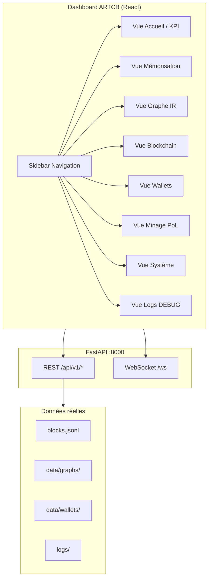

# CAHIER DES CHARGES — Dashboard ARTCB v1.0

**Horodatage :** 2026-07-07T01:30:00Z  
**Statut :** **EN ATTENTE VALIDATION UTILISATEUR** — pas de développement avant captures + accord explicite  
**Branche cible dev :** `cursor/dashboard-spec-1fce` (≠ `main`, **pas de merge sans ordre**)  
**Références :** PROTOCOLE_ARTCB, AUTO_PROMPT_ARTCB, CAHIER_DES_CHARGES_ARTCB v1.2, 2 dashboards inspirants (à recevoir)

---

## 0. Décision de cap (à valider)

| Avant (CDC §9.3) | Après (demande utilisateur 2026-07-07) |
|------------------|----------------------------------------|
| « Pas de dashboard administratif » — parcours narratif 60 s | **Vrai dashboard** remplaçant `Demo.tsx` |
| 1 page linéaire hackathon | Console multi-vues (monitoring, chain, wallets, minage, graphe) |

**⚠️ Contradiction documentaire :** le CDC §9.3 dit éviter un panel de stats. Ce cahier propose un **dashboard opérationnel** (pas un mock) aligné sur l’API réelle. Validation requise avant code.

---

## 1. Objectif produit

Remplacer la démo hackathon actuelle (`frontend/src/pages/Demo.tsx`) par un **dashboard ARTCB** professionnel qui :

1. Expose **toutes** les capacités backend déjà codées (API réelle, pas mock).
2. S’inspire de **2 dashboards de référence** (captures utilisateur — **50+ écrans à recevoir**).
3. Reste en **mode DEBUG** (PROTOCOLE) tant que l’utilisateur ne demande pas autrement.
4. Conserve le parcours cœur (mémoriser → graphe → PoL → blockchain) dans une vue dédiée.

---

## 2. État actuel (inventaire code réel)

### 2.1 Frontend existant (`main` @ `49c1b4a`)

| Composant | Fichier | Rôle |
|-----------|---------|------|
| Page unique | `Demo.tsx` | Parcours 9 étapes CDC §9.2 |
| Graphe | `GraphViewer.tsx` | Cytoscape |
| Agents | `AgentPanel.tsx` | Explorer / Critic |
| PoL | `PolGauge.tsx` | Jauge 3 métriques |
| Reconstruction | `Reconstruct.tsx` | Diff original / reconstruit |
| Métriques OS | `SystemMetrics.tsx` | CPU/RAM/disk via `/metrics` |
| API client | `api/client.ts` | axios + WebSocket |

**Limites actuelles :**
- Pas de routing (1 seule page).
- Pas de vue wallet / balance / rewards.
- Pas de vue chaîne (explorateur blocs).
- Pas de vue minage CLI intégrée.
- Pas de layout dashboard (sidebar, header, multi-panneaux).
- UX « hackathon demo », pas « produit ».

### 2.2 Backend déjà disponible (à brancher)

| Endpoint | Usage dashboard |
|----------|-----------------|
| `GET /health` | Statut global + chain |
| `GET /metrics` | Panneau système |
| `GET /pol/score` | KPI PoL global |
| `POST /agents/run` | Mémorisation |
| `GET /graph/{id}` | Visualisation |
| `POST /search` | Recherche sémantique |
| `POST /decode` | Reconstruction |
| `POST /store` | Signer bloc |
| `GET /chain`, `/chain/verify` | Explorateur blockchain |
| `GET/POST /wallet/*` | Wallets + balances |
| `WS /ws` | Encodage temps réel |
| `GET /demo/wailly-excerpt` | Source démo Wailly |

### 2.3 Scripts hors UI (à intégrer ou refléter)

| Script | Données à afficher |
|--------|-------------------|
| `mine_learning_simple.py` | Résultats minage, rewards |
| `create_founders_wallets.py` | Founders allocation |
| `benchmark_performance.py` | Perf IR / PoL / C |

---

## 3. Inspiration — 2 dashboards de référence

**⏸ BLOQUÉ** — en attente des **50+ captures** et de la **branche** contenant les 2 exemples.

### 3.1 Ce que nous analyserons sur chaque référence

| Critère | Questions |
|---------|-----------|
| Layout | Sidebar ? Top nav ? Grille ? |
| Palette | Sombre / clair ? Couleurs accent ? |
| KPI cards | Quels chiffres en hero ? |
| Graphes | Charts temps réel ? |
| Tables | Chain, wallets, logs ? |
| Actions | Boutons primaires où ? |
| Responsive | Mobile / desktop ? |

### 3.2 Matrice de synthèse (à remplir après captures)

| Zone | Dashboard réf. A | Dashboard réf. B | **Notre choix ARTCB** |
|------|------------------|------------------|------------------------|
| Navigation | ? | ? | À définir |
| Vue principale | ? | ? | Graphe + agents |
| Blockchain | ? | ? | Explorateur blocs |
| Wallets | ? | ? | Balances + founders |
| Monitoring | ? | ? | SystemMetrics étendu |
| Minage | ? | ? | Statut PoL + rewards |

---

## 4. Architecture cible proposée (v1 dashboard)



### 4.1 Wireframe ASCII (proposition avant captures)

```
┌──────────────────────────────────────────────────────────────────────────┐
│ ARTCB Dashboard          [● API OK] [PoL 0.60] [Blocs: 19]    [DEBUG]   │
├────────────┬─────────────────────────────────────────────────────────────┤
│ ▶ Accueil  │  ┌─────────┐ ┌─────────┐ ┌─────────┐ ┌─────────┐        │
│   Mémoriser│  │ PoL     │ │ Blocs   │ │ Wallets │ │ IR 100% │        │
│   Graphe   │  │  0.60   │ │   19    │ │  150 ₳  │ │ révers. │        │
│   Chaîne   │  └─────────┘ └─────────┘ └─────────┘ └─────────┘        │
│   Wallets  │  ┌──────────────────────────┬──────────────────────────┐  │
│   Minage   │  │ Graphe Cytoscape         │ Agents Explorer/Critic │  │
│   Système  │  │ (nœuds, liens, search)   │ + PoL gauge détaillée    │  │
│   Logs     │  └──────────────────────────┴──────────────────────────┘  │
│            │  [Reconstruire] [Signer bloc] [Lire nœud]                  │
├────────────┴─────────────────────────────────────────────────────────────┤
│ Footer: dernier bloc hash… · session · machine fingerprint (optionnel)  │
└──────────────────────────────────────────────────────────────────────────┘
```

---

## 5. Spécification fonctionnelle par vue

### V1 — Accueil (KPI)
- Cartes : `health`, `pol/score`, `chain.block_count`, `chain.valid`
- Liste derniers blocs (5)
- Alertes DEBUG (erreurs API)

### V2 — Mémorisation (remplace cœur Demo)
- Textarea + Wailly + `use_llm` toggle
- WebSocket animation encode
- `POST /agents/run` → graph_id

### V3 — Graphe IR
- Cytoscape (existant, enrichi)
- Search, sélection nœud, détail
- Reconstruct côte à côte

### V4 — Blockchain
- Table `blocks.jsonl` via `GET /chain`
- Vérification `GET /chain/verify`
- Détail bloc : hash, signature, pol, contributors, rewards

### V5 — Wallets
- `GET /wallet/list`, `POST /wallet/create`
- Balance par adresse
- Founders (lecture `data/founders/founders_allocation.json`)

### V6 — Minage PoL
- Statut minage (dernier `mining_results_*.json`)
- Lancer via API future ou afficher résultats scripts
- Historique rewards

### V7 — Système
- `SystemMetrics` (existant) + refresh 5s
- CPU, RAM, disk, network

### V8 — Logs DEBUG (PROTOCOLE)
- Lecture tail `logs/demo_live_latest.txt`, API JSON logs
- **Lecture seule** — pas de mock

---

## 6. Ce qui manque (gap analysis)

| # | Manque | Priorité | Action |
|---|--------|----------|--------|
| G1 | Captures 2 dashboards réf. | **P0** | Attendre utilisateur |
| G2 | Branche exemples dashboard | **P0** | Checkout quand poussée |
| G3 | React Router multi-pages | P1 | Dev après validation |
| G4 | API `GET /chain` liste enrichie contributors | P1 | Backend si besoin |
| G5 | API minage (wrapper script) | P2 | Endpoint ou job status |
| G6 | PDF Quintus dans repo | P2 | Asset manquant |
| G7 | Tests E2E Playwright dashboard | P2 | Post-MVP |
| G8 | Résolution conflit CDC §9.3 | **P0** | Validation utilisateur |

---

## 7. Plan de réalisation (après validation + captures)

| Phase | Contenu | % estimé | Gate |
|-------|---------|----------|------|
| **0** | Réception 50+ captures + analyse 2 refs | 0 % | **VOUS** |
| **1** | Maquettes figées + design tokens | 10 % | Validation plan |
| **2** | Layout shell (sidebar, routing) | 25 % | — |
| **3** | Migration Demo → vues V2–V3 | 45 % | Tests manuels |
| **4** | V4–V6 chain/wallet/minage | 70 % | API réelle |
| **5** | V7–V8 système + logs | 85 % | PROTOCOLE |
| **6** | Suppression `Demo.tsx` legacy | 95 % | Votre OK |
| **7** | Rapport + tests + PR | 100 % | **Pas merge main sans vous** |

**Avancement dashboard actuel : 5 %** (spec seulement)

---

## 8. Règles PROTOCOLE applicables

| Règle | Application dashboard |
|-------|----------------------|
| Pas de mock | Toutes les cartes branchées API réelle |
| DEBUG | Badge visible, logs accessibles |
| Rapport après exécution | `rapports/044_...` post-implémentation |
| Pas merge main sans ordre | Branche `cursor/dashboard-*` isolée |
| FR rapports / EN code | Inchangé |

---

## 9. Ce que je NE fais PAS maintenant

- ❌ Modifier `Demo.tsx`
- ❌ Fusionner vers `main`
- ❌ Coder le dashboard
- ❌ Deviner le design des 2 références sans captures

---

## 10. Validation attendue de vous

Répondez **OUI/NON** ou commentez :

1. [ ] Pivot dashboard validé (remplace démo) malgré CDC §9.3 ?
2. [ ] Architecture 8 vues (§5) OK ou à réduire ?
3. [ ] Branche séparée sans merge — OK ?
4. [ ] Envoi des 50+ captures + branche références — **quand prêt, dites « captures envoyées »**

---

**Document créé pour validation — aucun code produit.**
