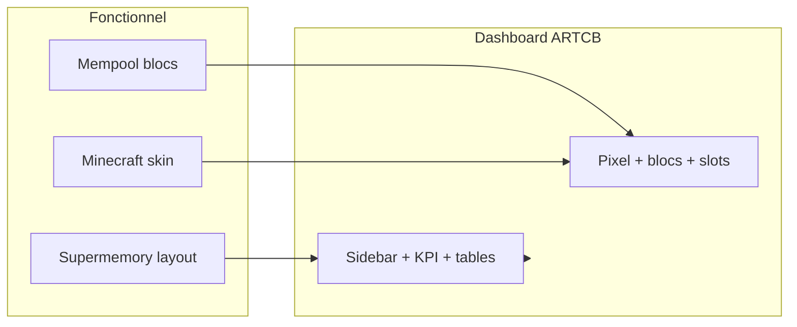

# Design ARTCB — Rétro 2D jeu vidéo × Minecraft

**Horodatage :** 2026-07-07T05:30:00Z  
**Statut :** **INTÉGRÉ** — shell dashboard V1–V10 sur `cursor/dashboard-dev-1fce`  
**Branche :** `cursor/dashboard-dev-1fce`  
**Demande utilisateur :** style **rétro 2D** type jeu vidéo + mélange **Minecraft**

---

## 1. Direction artistique

| Pilier | Description |
|--------|-------------|
| **Rétro 2D** | Pixel art, grille 8×8 / 16×16, pas de dégradés lisses, UI type NES/SNES |
| **Minecraft** | Blocs, inventaire, barres vie/XP, chunks, textures terre/pierre/herbe |
| **Dashboard SaaS** | Layout Supermemory/Cursor conservé — **peau** rétro par-dessus |



**Règle :** les données restent **réelles** (PROTOCOLE) — seul le **rendu** change.

---

## 2. Palette Minecraft × rétro

| Token CSS | Couleur | Usage Minecraft |
|-----------|---------|-----------------|
| `--mc-sky` | `#6BA3D6` | Ciel / header secondaire |
| `--mc-grass` | `#5D9B3A` | Succès, PoL OK, blocs mempool |
| `--mc-dirt` | `#8B6914` | Bordures, sidebar fond |
| `--mc-stone` | `#7F7F7F` | Panneaux, cartes |
| `--mc-deepslate` | `#505050` | Fond app |
| `--mc-bedrock` | `#2D2D2D` | Fond le plus sombre |
| `--mc-diamond` | `#4AEDD9` | Accent primaire, liens |
| `--mc-gold` | `#FFCC00` | Rewards ARTCB, KPI or |
| `--mc-redstone` | `#FF3333` | Erreurs, DEBUG alert |
| `--mc-obsidian` | `#1A0A2E` | Console CLI fond |

---

## 3. Typographie

| Rôle | Police | Fallback |
|------|--------|----------|
| Titres / HUD | **Press Start 2P** | monospace |
| Corps / tables | **VT323** | monospace |
| CLI terminal | **VT323** | 18–20px |

```html
<!-- index.html -->
<link href="https://fonts.googleapis.com/css2?family=Press+Start+2P&family=VT323&display=swap" rel="stylesheet">
```

---

## 4. Composants UI — style bloc

### 4.1 Bouton Minecraft (bevel)

```
┌──────────────┐
│▓▓ MÉMORISER ▓▓│  ← highlight haut/gauche clair
│░░░░░░░░░░░░░░│  ← ombre bas/droite foncée
└──────────────┘
```

CSS : `border: 4px solid; border-color: #fff #555 #555 #fff` (état normal), inversé au `:active`.

### 4.2 Carte KPI = slot inventaire

```
┌──┬────────────┐
│💎│ PoL  0.60  │  icône pixel 16×16 + valeur
│  │ ████░░     │  barre style barre de vie MC
└──┴────────────┘
```

- Fond `#7F7F7F` (pierre)
- Bordure 4px relief
- Pas de `border-radius` > **0** (coins carrés)

### 4.3 Chaîne / minage = blocs 3D faux (CSS)

Inspiré Mempool + Minecraft :

```
┌───┐┌───┐┌───┐
│#19││#18││#17│  face top plus claire
└───┘└───┘└───┘  face droite ombre
```

Couleurs : mempool **vert herbe** (attente) / **violet diamant** (miné).

### 4.4 Sidebar = menu pause jeu

```
╔══════════════╗
║ ▶ ACCUEIL    ║  item actif = fond grass + texte blanc pixel
║   MÉMORISER  ║
║   GRAPHE     ║
╚══════════════╝
```

### 4.5 Badge DEBUG = texte rouge pixel clignotant léger

`animation: pixel-blink 1.2s step-end infinite`

---

## 5. Wireframe shell rétro (remplace look SaaS sombre)

```
╔══════════════════════════════════════════════════════════════════════════╗
║ ⛏ ARTCB  ♥ API OK  ◆ PoL 0.60  ▣ Blocs 19  [DEBUG!]  [⌨ CONSOLE]     ║
╠════════════╦═════════════════════════════════════════════════════════════╣
║ ▶ ACCUEIL  ║  ┌────┐ ┌────┐ ┌────┐ ┌────┐  ← slots KPI                  ║
║   MÉMORISER║  │PoL │ │CHN │ │WLT │ │IR  │                               ║
║   GRAPHE   ║  └────┘ └────┘ └────┘ └────┘                               ║
║ ▣ CHAÎNE   ║  ┌───┐┌───┐┌───┐  blocs chaîne (style MC + mempool)        ║
║ ◇ WALLETS  ║                                                              ║
║ ⛏ MINAGE   ║         [ ZONE VUE ACTIVE — pixel grid 16px ]               ║
║ ⚙ SYSTÈME  ║                                                              ║
║ 📜 LOGS    ║                                                              ║
║ ⌨ CONSOLE  ║                                                              ║
╠════════════╩═════════════════════════════════════════════════════════════╣
║ Bloc #19 · 1 ARTCB · hash 8edfa3b… · [Réseau: PRIVÉ ▼]                  ║
╚══════════════════════════════════════════════════════════════════════════╝
```

---

## 6. Mapping vues × éléments Minecraft

| Vue | Élément rétro MC |
|-----|------------------|
| V1 Accueil | Hotbar KPI (9 slots), barre XP = progression parcours |
| V2 Mémoriser | Table d'enchantement / crafting grid pour textarea |
| V3 Graphe | Monde 2D chunks (Cytoscape nodes = blocs colorés par type nœud) |
| V4 Chaîne | Blocs empilés + numéro hauteur (comme MC debug) |
| V5 Wallets | Coffre (chest) UI — grille 6×9 slots |
| V6 Minage | Pioche + table minage + reward or (1 ARTCB) |
| V7 Système | F3 debug screen (CPU/RAM texte vert sur noir) |
| V8 Logs | Chat MC (texte qui défile, fond semi-transparent) |
| V9 Console | Terminal DOS vert/ambre sur noir |
| V10 Groupes | Panneau équipe multijoueur (skins têtes pixel) |

---

## 7. Grille & contraintes techniques

| Règle | Valeur |
|-------|--------|
| Grille base | **8px** ou **16px** |
| `border-radius` | **0** (sauf exception 2px) |
| Ombres | **désactivées** — relief par bordures 4px uniquement |
| Images | pixel art 16×16 / 32×32 (pas de SVG lissés pour icônes) |
| `image-rendering` | `pixelated` sur sprites |
| Mode sombre | fond deepslate/bedrock (pas noir SaaS) |

---

## 8. Ce qu'on ne fait PAS

- ❌ Minecraft 3D WebGL (trop lourd pour MVP)
- ❌ Assets copyrighted Mojang (style inspiré, pas textures officielles)
- ❌ Mock data pour remplir l'UI

---

## 9. Validation

```
1. Direction rétro 2D + Minecraft : OUI / NON / MODIFIER
2. Polices Press Start 2P + VT323 : OUI / NON
3. Coins carrés (pas arrondis) : OUI / NON
4. Blocs chaîne style MC : OUI / NON
```

---

**Document design — à appliquer dans `frontend/src/index.css` + composants dashboard.**
