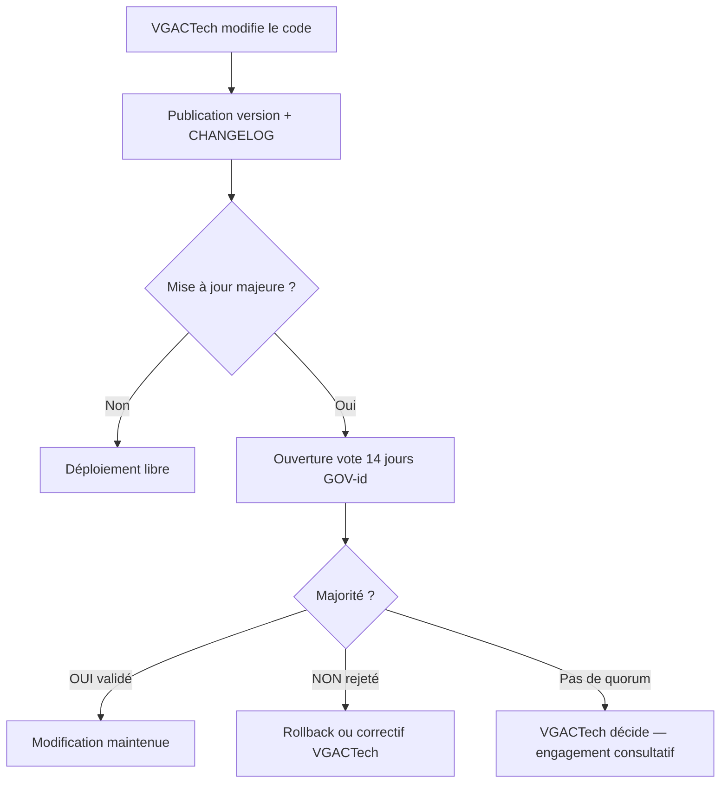

# GOUVERNANCE ARTCB — Qui décide quoi ?

**Titulaire :** VGACTech (Société)  
**Contact officiel :** vgacofficiel@gmail.com  
**Horodatage :** 2026-07-08T22:00:00Z  
**Statut :** Règles actées par le représentant VGACTech

---

## 1. Les deux choses à ne jamais confondre

Imaginez ARTCB comme **une application** (le programme) + **un carnet** (la blockchain).

| | **Le CODE** (logiciel) | **La BLOCKCHAIN** (données) |
|--|------------------------|------------------------------|
| **C’est quoi ?** | Fichiers Python, React, C sur GitHub | Liste des blocs déjà signés (`blocks.jsonl`) |
| **Peut-on effacer ?** | Oui — on remplace par une nouvelle version | **Non** — on ajoute seulement des pages |
| **Qui écrit le code ?** | **VGACTech** (à tout moment) | — |
| **Qui écrit sur la chaîne ?** | — | Chaque utilisateur avec son wallet |
| **Vote des utilisateurs ?** | Voir section 3 (engagement rollback) | Pas de vote pour écrire un bloc |

---

## 2. Règle n°1 — VGACTech peut modifier le code à tout moment

**OUI, sans vote préalable.**

VGACTech (vous) pouvez à **n’importe quel moment** :

- modifier le code sur GitHub ;
- publier une nouvelle version ;
- corriger des bugs ;
- ajouter ou retirer des fonctionnalités ;
- changer les licences (décision écrite VGACTech seule — voir `LICENCE_ARTCB.md`).

**Comparaison :** Vous êtes constructeur de l’application. Vous sortez une mise à jour quand vous voulez. Les utilisateurs ne signent pas un contrat de vote avant chaque mise à jour.

---

## 3. Règle n°2 — Engagement de correction si la majorité rejette une modification

**Engagement VGACTech (promesse officielle) :**

> Si une **modification du code** (mise à jour numérotée, voir §5) est **rejetée par la majorité** des utilisateurs votants, VGACTech **s’engage à corriger** — c’est-à-dire **revenir en arrière** (rollback) ou **publier un correctif** qui annule l’effet de la modification rejetée.

### 3.1 Quand déclencher une correction ?

| Situation | VGACTech corrige ? |
|-----------|-------------------|
| Mise à jour publiée, **aucun vote** | **Non** — la version reste (vous gardez le droit de modifier) |
| Vote en cours, **pas encore majorité** | **Non** — attente fin de période de vote |
| **Majorité a voté NON** (rejet) | **OUI** — rollback ou correctif obligatoire (engagement) |
| **Majorité a voté OUI** (validation) | **Non** — la modification est acceptée par la communauté |
| VGACTech corrige un **bug de sécurité critique** | **Oui**, même sans vote — exception sécurité (notifiée aux utilisateurs) |

### 3.2 Qui vote ?

| Éligible | Détail |
|----------|--------|
| Détenteur d’un **wallet ARTCB** actif | Au moins 1 bloc mémorisé ou membre d’un groupe |
| **1 wallet = 1 voix** | Pas de pluralité de voix par personne (anti-sybil à renforcer en P2P) |
| **Majorité** | Plus de 50 % des voix **exprimées** pendant la période de vote |

### 3.3 Durée et annonce

| Paramètre | Valeur proposée (modifiable par VGACTech) |
|-----------|-------------------------------------------|
| Période de vote | **14 jours** après publication d’une mise à jour majeure |
| Annonce | Changelog + email `vgacofficiel@gmail.com` + note dans l’app |
| Id de proposition | `GOV-YYYY-MM-DD-NNN` (ex. `GOV-2026-07-08-001`) |

### 3.4 État technique du vote (honnêteté)

| Composant | Statut |
|-----------|--------|
| Règle écrite (ce document) | ✅ Actée |
| API `POST /governance/vote` | ❌ **Pas encore codée** — à implémenter |
| Interface dashboard « Voter » | ❌ **Pas encore codée** |
| En attendant | Votes par procédure manuelle documentée (issue GitHub + wallets listés) ou attente implémentation |

**Important :** L’**engagement moral et contractuel** de VGACTech existe dès maintenant. Le **mécanisme automatique** viendra en phase suivante.

---

## 4. Comment se passent les modifications sur les blockchains (explication simple)

### 4.1 Les données déjà sur la chaîne — **on ne les modifie pas**

Une fois un bloc accepté (PoL ≥ 0,6, signature valide), il est **gravé** dans le carnet.

- On ne « modifie » pas un bloc ancien.
- On **ajoute** un nouveau bloc.
- C’est pareil sur Bitcoin, Ethereum, et ARTCB.

**Si le code change :** les **anciens blocs restent lisibles**. Le nouveau code sait (en principe) lire l’ancien format, ou migre les données.

### 4.2 Les **règles** de la blockchain — elles changent avec le **nouveau code**

Exemples de règles dans le logiciel :

| Règle | Où c’est défini aujourd’hui |
|-------|----------------------------|
| PoL minimum 0,6 | `src/artcb/pol/scorer.py`, settings |
| Reward 1 ARTCB | `src/artcb/tokenomics.py` |
| Visibilité private/group/public | `src/api/routes.py` |
| Groupes request-to-join | `src/artcb/groups/` |

Quand VGACTech publie une **nouvelle version du programme** :

1. Le serveur / nœud exécute le **nouveau code**.
2. Les **nouveaux blocs** suivent les **nouvelles règles**.
3. Les **anciens blocs** restent tels quels dans l’historique.

**Comparaison :** Changer la loi pour l’avenir ne efface pas les actes notariés passés.

### 4.3 Types de changements (vocabulaire blockchain)

| Type | Explication simple | ARTCB aujourd’hui |
|------|-------------------|-------------------|
| **Mise à jour mineure** | Correction bug, pas de changement de règles | Vous déployez, pas de vote requis |
| **Mise à jour majeure** | Change les règles (PoL, rewards, ACL…) | Soumise au vote §3 si annoncée comme majeure |
| **Fork** | Deux versions du réseau qui divergent | Pas applicable — **un seul nœud** (MVP) |
| **Migration** | Convertir les anciens fichiers au nouveau format | Script manuel si besoin ; pas automatisé |

### 4.4 État actuel ARTCB (réalité technique)

| Aspect | Réalité |
|--------|---------|
| Nombre de nœuds | **1** (votre machine / serveur) — pas de réseau mondial |
| Qui exécute le code ? | **Celui qui installe** le programme (vous ou un hébergeur) |
| Décentralisation | **Objectif PROTOCOLE** — pas encore en production |
| Conséquence | Aujourd’hui, **VGACTech + l’opérateur du nœud** contrôlent les règles appliquées aux **nouveaux** blocs |

Quand il y aura **plusieurs nœuds** (P2P), chaque opérateur choisira d’installer ou non votre mise à jour — là, le vote communautaire aura plus de poids réel.

---

## 5. Processus de publication d’une modification (workflow)

### Numérotation des versions

- **Majeure** (sujet au vote) : change règles PoL, tokenomics, ACL, format de bloc.
- **Mineure** : UI, logs, performance, bugs.
- **Sécurité** : correctif immédiat possible (exception §3.1).

---

## 6. Ce que les utilisateurs NE peuvent PAS faire

| Action | Possible ? |
|--------|------------|
| Modifier le code sur le dépôt VGACTech | **Non** (sans autorisation — licence propriétaire) |
| Effacer un bloc passé sur la chaîne | **Non** |
| Forcer VGACTech à publier du code | **Non** |
| Voter pour **imposer** une fonctionnalité | **Non** — seulement **rejeter** ou **valider** une MAJ majeure proposée |
| Changer la licence | **Non** — VGACTech seule |

---

## 7. Ce que les utilisateurs PEUVENT faire

| Action | Possible ? |
|--------|------------|
| Contrôler leurs clés privées et données privées | **Oui** |
| Voter sur une mise à jour majeure (quand API prête) | **Oui** |
| Refuser d’installer une nouvelle version | **Oui** (en multi-nœud futur) |
| Quitter un groupe / ne plus utiliser l’app | **Oui** |
| Exporter leurs données (selon features) | **Oui** (si implémenté) |

---

## 8. Liens avec les autres documents

| Document | Sujet |
|----------|--------|
| `LICENCE_ARTCB.md` | Droits de copie / usage (privé, groupe, public) |
| `LICENSE-PROPRIETAIRE.md` | Code fermé privé/groupe |
| `LICENSE-PUBLIC-BSL.md` | Code public BSL |
| `PROTOCOLE_ARTCB` | Règles de développement interne |
| `GOUVERNANCE_ARTCB.md` | **Ce fichier** — qui décide des mises à jour |

---

## 9. Historique

| Date | Décision |
|------|----------|
| 2026-07-08 | Licences VGACTech (propriétaire + BSL) |
| 2026-07-08 | Gouvernance : modification libre VGACTech + engagement rollback si majorité rejette |
| 2026-07-08 | Contact : vgacofficiel@gmail.com |

---

**© 2026 VGACTech — vgacofficiel@gmail.com**
