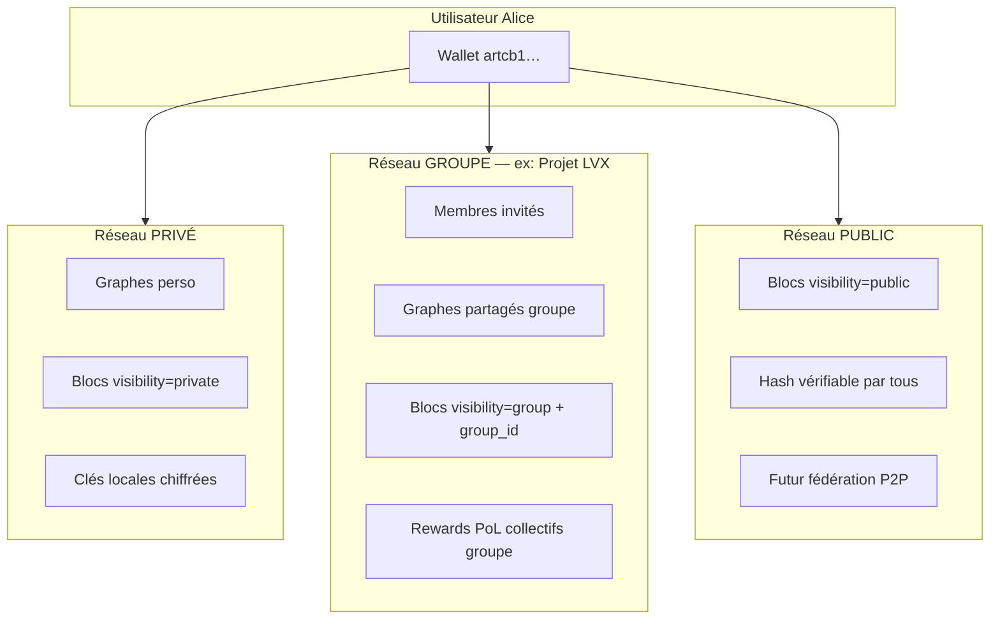
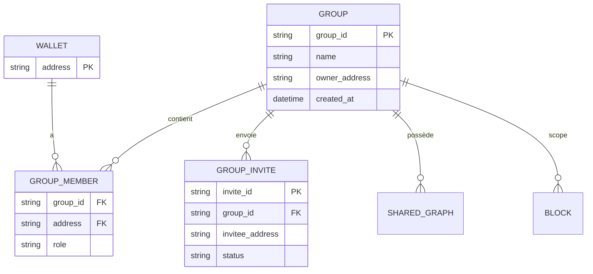
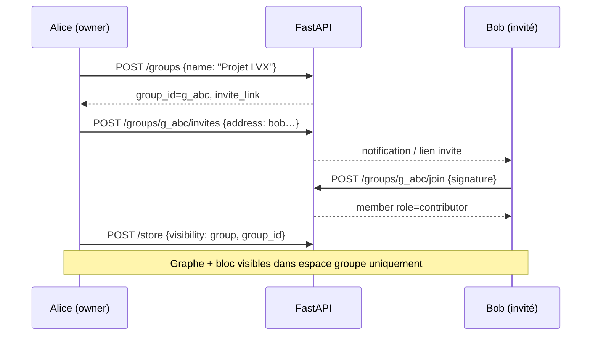

# Groupes & Réseaux ARTCB — Spécification v1.0

**Horodatage :** 2026-07-07T04:45:00Z  
**Statut :** **EN ATTENTE VALIDATION** — non implémenté backend  
**Branche spec :** `cursor/dashboard-spec-1fce` (pas merge `main` sans accord)

---

## 1. Réponse directe à votre question

| Question | Réponse |
|----------|---------|
| Le CDC dashboard actuel inclut-il les groupes multi-utilisateurs ? | **Non** — jusqu’à v1.4, seulement inspiration visuelle Cursor Members / Supermemory Organization |
| Existe-t-il déjà en backend ? | **Non** — pas de modèle groupe, invitation, membership, ACL |
| Existe-t-il partiellement ? | **Oui, minimal** — champ `visibility: "private"` sur les blocs (stocké, **non filtré**) |
| Mode « Shared / groupe » documenté ? | **FAQ seulement** — `FAQ_NON_EXPERTS_ARTCB.md` mentionne Shared, **code absent** |

**Conclusion :** votre vision **Public / Privé / Groupe** doit être **ajoutée de bout en bout** (backend + API + dashboard).

---

## 2. Modèle cible — trois réseaux



| Réseau | Qui voit quoi ? | Qui peut contribuer ? | Inspiration captures |
|--------|-----------------|----------------------|----------------------|
| **Privé** | Seul le propriétaire wallet | Moi seul | Supermemory org perso |
| **Groupe** | Membres du groupe uniquement | Membres avec rôle ≥ contributor | **Cursor Teams / Supermemory Team** |
| **Public** | Tout le monde (hash + métadonnées) | Tout détenteur wallet (anti-Sybil) | Mempool public chain |

---

## 3. Ce qui existe aujourd’hui (audit code)

| Élément | Fichier | État |
|---------|---------|------|
| `visibility` sur bloc | `chain/manager.py`, `routes.py` StoreRequest | ✅ stocké (`private` défaut) |
| Filtrage par visibility | — | ❌ absent |
| `visibility: public` | CDC §3.2.5 | ⚠️ prévu, non testé UI |
| `visibility: shared` + `group_id` | — | ❌ absent |
| Comptes utilisateurs | — | ❌ absent (wallet = identité) |
| CRUD groupes | — | ❌ absent |
| Invitations | — | ❌ absent |
| ACL par graphe/bloc | — | ❌ absent |

**Identité actuelle :** adresse wallet Ed25519 (`artcb1…`) — pas de login email/mot de passe.

---

## 4. Spécification fonctionnelle — Groupes

### 4.1 Entités



### 4.2 Rôles groupe

| Rôle | Lire graphes | Mémoriser | Signer bloc | Inviter | Gérer groupe |
|------|--------------|-----------|-------------|---------|--------------|
| **owner** | ✓ | ✓ | ✓ | ✓ | ✓ |
| **admin** | ✓ | ✓ | ✓ | ✓ | — |
| **contributor** | ✓ | ✓ | ✓ | — | — |
| **viewer** | ✓ | — | — | — | — |

### 4.3 Flux — créer un groupe et inviter



### 4.4 API proposée (nouveau — P1)

| Méthode | Endpoint | Action |
|---------|----------|--------|
| POST | `/groups` | Créer groupe (wallet signataire = owner) |
| GET | `/groups` | Lister mes groupes |
| GET | `/groups/{id}` | Détail + membres |
| POST | `/groups/{id}/invites` | Inviter par adresse wallet |
| POST | `/groups/{id}/join` | Accepter invitation (signature) |
| DELETE | `/groups/{id}/members/{addr}` | Retirer membre (admin+) |
| GET | `/groups/{id}/graphs` | Graphes du groupe |
| GET | `/groups/{id}/chain` | Blocs filtrés `visibility=group` |
| POST | `/store` | **étendu** : `visibility` = `private\|group\|public`, `group_id?` |

### 4.5 Stockage (MVP fichier)

```
data/groups/
  g_abc123.json          # métadonnées groupe
  g_abc123_members.jsonl # membres + rôles
  g_abc123_invites.jsonl # invitations pending
```

Extension bloc JSONL :
```json
{
  "visibility": "group",
  "group_id": "g_abc123",
  ...
}
```

---

## 5. Dashboard — Vue V10 Groupes

Voir `DASHBOARD_WIREFRAMES_ASCII.md` § V10.

**Sélecteur contexte** (header global — style Supermemory org dropdown) :
```
[ Mon espace ▼ ]  →  Privé | Groupe: Projet LVX | Public
```

Toutes les vues V1–V8 **filtrent les données** selon le contexte réseau actif.

---

## 6. Plan d’intégration bout en bout

| Phase | Contenu | % | Gate |
|-------|---------|---|------|
| **G0** | Validation spec groupes (ce doc) | 0 % | **Vous** |
| **G1** | Modèle `GroupManager` + fichiers JSON | 15 % | Tests unitaires |
| **G2** | API `/groups/*` + auth signature wallet | 30 % | Postman / pytest |
| **G3** | `visibility` + `group_id` sur store/chain + filtrage | 50 % | Tests ACL |
| **G4** | Dashboard V10 + sélecteur réseau header | 70 % | GO dashboard |
| **G5** | Invitations UI + notifications | 85 % | Tests manuels |
| **G6** | P2P fédération public (hors MVP) | — | Phase ultérieure |

**Dépendance :** phases G1–G3 peuvent démarrer **avant** le dashboard ; G4–G5 dans le dashboard.

---

## 7. Validation attendue

```
1. Modèle 3 réseaux (privé / groupe / public) : OUI / NON
2. Identité = wallet (pas email) pour MVP : OUI / NON
3. Rôles owner/admin/contributor/viewer : OUI / MODIFIER
4. Invitations par adresse wallet : OUI / AUTRE (lien, QR…)
5. Intégrer G1–G3 backend AVANT dashboard : OUI / NON
6. GO implémentation groupes : OUI / NON
```

---

**Non implémenté — document de validation uniquement.**
