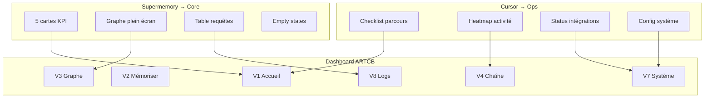

# Rapport 044 — Analyse 50 captures + plan validation dashboard

**Horodatage :** 2026-07-07T03:55:00Z  
**CDC :** `CAHIER_DES_CHARGES_DASHBOARD_ARTCB.md` **v1.2**  
**Branche captures :** `cursor/dashboard-captures-1fce` (`8edfa3b`) — **50 PNG sur GitHub** ✅  
**Branche spec :** `cursor/dashboard-spec-1fce`

---

## 1. État captures

| Source | Nombre | Statut |
|--------|--------|--------|
| GitHub `origin/cursor/dashboard-captures-1fce` | **50** | ✅ |
| Agent Cloud `/workspace` | **50** | ✅ analysés |
| Dossier | `captures_dashboard_reference/` | PNG 01:33 → 02:07 |

---

## 2. Expertises mobilisées

| Expertise | Rôle |
|-----------|------|
| **UX / Product Design** | Analyse Supermemory + Cursor, matrice synthèse |
| **Architecture frontend** | Mapping 8 vues ARTCB, design tokens |
| **Mapping API** | Branchement données réelles |
| **PROTOCOLE** | Pas de mock, DEBUG, pas de merge `main` |

---

## 3. Les 2 références identifiées

### Référence A — Supermemory.ai (~19 captures)

**URL :** `console.supermemory.ai`  
**Rôle :** cœur produit — mémoire, graphe, requêtes, documents.

**Vues capturées :**
- Overview (5 KPI + 4 cartes onboarding)
- Memory Graph (empty state + légende)
- Requests (donut + table TYPE/STATUS/DURATION)
- Documents (empty state + CTA import)
- Integrations / Plugins (grille MCP)
- Billing (barre usage + graphique daily spend)
- Setup Codex (modale API key + hooks)

### Référence B — Cursor.com Dashboard (~31 captures)

**URL :** `cursor.com/dashboard`  
**Rôle :** console ops — config, usage, intégrations, agents.

**Vues capturées :**
- Overview (crédits, checklist 2/4, plans Pro/Ultra, heatmap activité)
- Cloud Agents (`vgac2025/lvx`, préfixe `cursor/`)
- Plugins marketplace
- Bugbot / Repository rules
- Integrations (GitHub connecté)
- Members / Teams upsell
- Agents UI (`cursor.com/agents`)

---

## 4. Synthèse design pour ARTCB



**Décision clé :** hybride A+B — Supermemory pour le workflow IR, Cursor pour le monitoring chain/system.

---

## 5. Matrice inspiration (complétée)

| Zone UI | Supermemory | Cursor | Choix ARTCB |
|---------|-------------|--------|-------------|
| Navigation | Sidebar sections | Sidebar groupée | Sidebar style A |
| Header | Org + docs | Crédits | DEBUG + PoL + API ● |
| Accueil | 5 KPI | Checklist + heatmap | Hybride |
| Graphe | Memory Graph | — | Cytoscape existant |
| Tables | Requests | — | Chaîne + Logs |
| Monitoring | Billing bars | Usage heatmap | SystemMetrics + heatmap blocs |
| Intégrations | Plugin grid | Connect list | Status services |

---

## 6. Design tokens proposés

| Token | Valeur |
|-------|--------|
| Fond app | `#0a0a0a` |
| Cartes | `#141414` |
| Accent | `#3b82f6` |
| Succès | `#22c55e` |
| Sidebar | `240px` |

Détail : CDC §3.4.

---

## 7. Plan phases

| Phase | % | Gate |
|-------|---|------|
| Analyse captures | **40 %** | ✅ Fait |
| Validation CDC v1.2 | 40 % | **Votre OUI** |
| Layout shell + routing | 55 % | GO code |
| Migration Demo → vues | 75 % | Tests |
| Chain / wallet / minage | 90 % | API réelle |
| Suppression Demo.tsx | 95 % | Votre OK |
| Merge `main` | — | **Jamais sans vous** |

---

## 8. Ce que je NE fais PAS encore

- ❌ Modifier `Demo.tsx`
- ❌ Coder le dashboard
- ❌ Merger `main`

---

## 9. Validation attendue

```
1. Pivot dashboard : OUI / NON
2. Architecture 8 vues : OUI / NON / MODIFIER
3. Branche isolée : OUI / NON
4. Push captures : FAIT ✅
5. Design tokens + matrice : OUI / NON / MODIFIER
6. GO code dashboard : OUI / NON
```

---

**Documents liés :** `CAHIER_DES_CHARGES_DASHBOARD_ARTCB.md` v1.2 · `captures_dashboard_reference/` (50 PNG)
