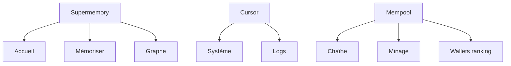

# Rapport 044 — Analyse 65 captures + plan validation dashboard

**Horodatage :** 2026-07-07T04:10:00Z  
**CDC :** `CAHIER_DES_CHARGES_DASHBOARD_ARTCB.md` **v1.3**  
**Branche captures :** `cursor/dashboard-captures-1fce` (`f37c11b`) — **65 PNG** ✅  
**Branche spec :** `cursor/dashboard-spec-1fce`

---

## 1. État captures

| Commit | Fichiers | Contenu |
|--------|----------|---------|
| `8edfa3b` | 50 | Supermemory + Cursor |
| `f37c11b` | +15 | **Mempool.space** (nouveau) |
| **Total** | **65** | 3 références |

---

## 2. Les 3 références

| Réf. | Produit | Captures | Rôle ARTCB |
|------|---------|----------|------------|
| **A** | Supermemory.ai | 19 | Cœur IR : KPI, graphe, requêtes |
| **B** | Cursor.com | 31 | Ops : config, checklist, intégrations |
| **C** | Mempool.space | 15 | **Blockchain** : blocs, minage, tables tx |

### Lot C — Mempool (nouveau)

Vues capturées :
- Enterprise (REST API, Electrum, Websockets, Accelerator, Mining Data)
- Homepage / graphs mempool (area + line charts live)
- Mining (pools donut, hashrate, table blocs, difficulty)
- Lightning (carte monde, rankings)
- Acceleration (stats + table historique)
- Dashboard principal (fee estimates, mempool goggles, RBF, tx récentes)

**Impact :** comble le gap **V4 Chaîne** et **V6 Minage** que Supermemory/Cursor ne couvraient pas.

---

## 3. Synthèse design ARTCB v1.3



---

## 4. Captures potentiellement encore manquantes

| ID | Vue | Priorité |
|----|-----|----------|
| M1 | Détail bloc (click) | P1 |
| M7 | Screenshot Demo ARTCB actuelle | P1 |
| M3 | Supermemory Playground | P2 |
| M5 | Cursor Usage détail | P2 |
| M8 | Wallet / adresse Mempool | P2 |

Détail : CDC §3.8.

---

## 5. Avancement

| Phase | % |
|-------|---|
| Analyse 65 captures | **45 %** ✅ |
| Validation CDC | En attente |
| Code dashboard | 0 % |

---

## 6. Commandes ajout futures captures

```bash
cd ~/ARTCB/lvx
git checkout cursor/dashboard-captures-1fce
# copier PNG dans captures_dashboard_reference/
git add captures_dashboard_reference/
git commit -m "docs: captures dashboard complementaires"
git push origin cursor/dashboard-captures-1fce
```

**Branche :** `cursor/dashboard-captures-1fce` (sans `-2`).

---

## 7. Validation

```
1. Pivot dashboard : OUI / NON
2. Architecture 8 vues : OUI / NON
3. 3 références A+B+C : OUI / NON
4. Checklist §3.8 — ajouter encore ? OUI / NON / captures complètes
5. GO code dashboard : OUI / NON
```

---

**Pas de code · pas de merge main sans vous.**
