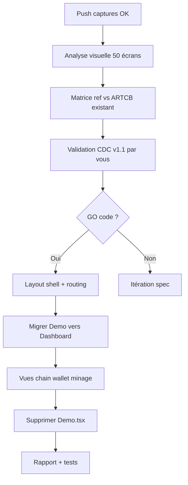
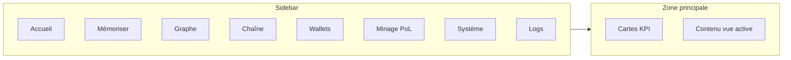

# Rapport 044 — Captures dashboard + plan validation

**Horodatage :** 2026-07-07T02:15:00Z  
**CDC :** `CAHIER_DES_CHARGES_DASHBOARD_ARTCB.md` **v1.1**
**Branche captures :** `cursor/dashboard-captures-1fce` (commit local `8edfa3b` — **push échoué**)  
**Branche spec :** `cursor/dashboard-spec-1fce`  
**Agent Cloud :** **0 capture reçue** tant que push non corrigé

---

## 1. État captures

| Source | Nombre | Statut |
|--------|--------|--------|
| Machine utilisateur (`~/ARTCB/lvx`) | **50 PNG** | Commit local OK |
| GitHub `origin/cursor/dashboard-captures-1fce` | **0** | ❌ `vgacgit00` denied |
| Agent Cloud `/workspace` | **0** | En attente `git pull` |

**Fichiers :** `captures_dashboard_reference/Screenshot From 2026-07-07 *.png`  
**Période :** 01:33 → 02:07 (séquence continue — probablement **1 produit** parcouru en profondeur ; séparation A/B à confirmer après analyse visuelle).

---

## 2. Expertises mobilisées

| Expertise | Rôle |
|-----------|------|
| **UX / Product Design** | Structure dashboard, navigation, KPI |
| **Architecture frontend** | React, routing, layout shell |
| **Mapping API** | Branchement données réelles ARTCB |
| **Git / DevOps** | Branches isolées, pas de merge `main` |
| **PROTOCOLE** | Pas de mock, DEBUG, rapport après logs |

---

## 3. Plan (phases — pas de code sans votre GO)



| Phase | % | Gate |
|-------|---|------|
| Push + pull captures | 15 % | SSH `vgac2025` |
| Analyse 50 écrans | 30 % | Fichiers sur remote |
| CDC validé | 40 % | **Votre OUI** |
| Développement | 40→100 % | **Votre GO code** |
| Merge `main` | — | **Jamais sans vous** |

**Avancement dashboard : 15 %** (CDC v1.1 + 50 captures côté vous, 0 côté agent)

**Documents poussés sur :** `cursor/dashboard-spec-1fce`

---

## 4. Ce qui existe (backend + frontend actuel)

### 4.1 À conserver et intégrer au dashboard

| Module | Fichier | Dashboard cible |
|--------|---------|-----------------|
| Graphe IR | `GraphViewer.tsx` | Vue Graphe |
| Agents | `AgentPanel.tsx` | Panneau latéral |
| PoL | `PolGauge.tsx` | KPI + vue détail |
| Reconstruction | `Reconstruct.tsx` | Vue Mémoriser |
| Métriques OS | `SystemMetrics.tsx` | Vue Système |
| API client | `api/client.ts` | Toutes vues |

### 4.2 API réelle déjà prête

`health`, `metrics`, `pol/score`, `agents/run`, `graph/*`, `search`, `decode`, `store`, `chain/*`, `wallet/*`, WebSocket `/ws`

### 4.3 À ajouter (gap)

- React Router + layout sidebar/header
- Vue explorateur blockchain (table blocs)
- Vue wallets + founders
- Vue minage (résultats `mining_results_*.json`)
- Vue logs DEBUG
- **Remplacement** `Demo.tsx` (pas coexistence longue)

---

## 5. Architecture dashboard ARTCB proposée (validation)



### Wireframe cible

```
┌─────────────────────────────────────────────────────────────────┐
│ ARTCB  │ PoL 0.60 │ Blocs 19 │ DEBUG │ API ●                      │
├────────┬────────────────────────────────────────────────────────┤
│ Accueil│  ┌──────┐ ┌──────┐ ┌──────┐ ┌──────┐                     │
│ Mémori.│  │ PoL  │ │Chain │ │Wallet│ │ IR   │                     │
│ Graphe │  └──────┘ └──────┘ └──────┘ └──────┘                     │
│ Chaîne │  ┌─────────────────────────┬─────────────────────┐      │
│ Wallet │  │ Cytoscape / table / form │ Agents + PoL gauge  │      │
│ Minage │  └─────────────────────────┴─────────────────────┘      │
│ Système│  [Actions contextuelles]                                 │
│ Logs   │                                                          │
└────────┴──────────────────────────────────────────────────────────┘
```

---

## 6. Matrice inspiration (à compléter après analyse images)

| Zone UI | Référence captures | ARTCB actuel | Décision proposée |
|---------|-------------------|--------------|-------------------|
| Navigation | ⏳ analyse | Aucune | Sidebar fixe |
| Palette | ⏳ analyse | Sombre `#0b0f14` | Aligner sur captures |
| KPI cards | ⏳ analyse | PolGauge partiel | Row Accueil |
| Graphe | ⏳ analyse | Cytoscape | Conserver |
| Tables | ⏳ analyse | Aucune | Vue Chaîne |
| Monitoring | ⏳ analyse | SystemMetrics | Vue Système |

---

## 7. Changement de cap vs CDC §9.3

| Avant | Après (validé par vous ?) |
|-------|---------------------------|
| Pas de dashboard admin | **Dashboard opérationnel** |
| Parcours 60 s linéaire | **Multi-vues** + parcours mémoriser conservé |

---

## 8. Ce que je NE fais PAS encore

- ❌ Modifier `Demo.tsx`
- ❌ Coder le dashboard
- ❌ Merger `main`
- ❌ Analyse pixel des captures (fichiers absents sur Cloud)

---

## 9. Actions requises

### Vous (maintenant)
1. Corriger SSH → `INSTRUCTIONS_PUSH_CAPTURES_SSH.md`
2. `git push -u origin cursor/dashboard-captures-1fce`
3. Valider CDC : répondre **OUI/NON** sur §7 et architecture §5

### Moi (après push OK)
1. `git fetch && git checkout cursor/dashboard-captures-1fce`
2. Analyse des 50 PNG → mise à jour §6
3. CDC v1.2 détaillé avec mapping écran par écran

### Pour lancer le code
Dire explicitement : **« GO code dashboard »** (après validation CDC)

---

**Documents liés :** `CAHIER_DES_CHARGES_DASHBOARD_ARTCB.md`
