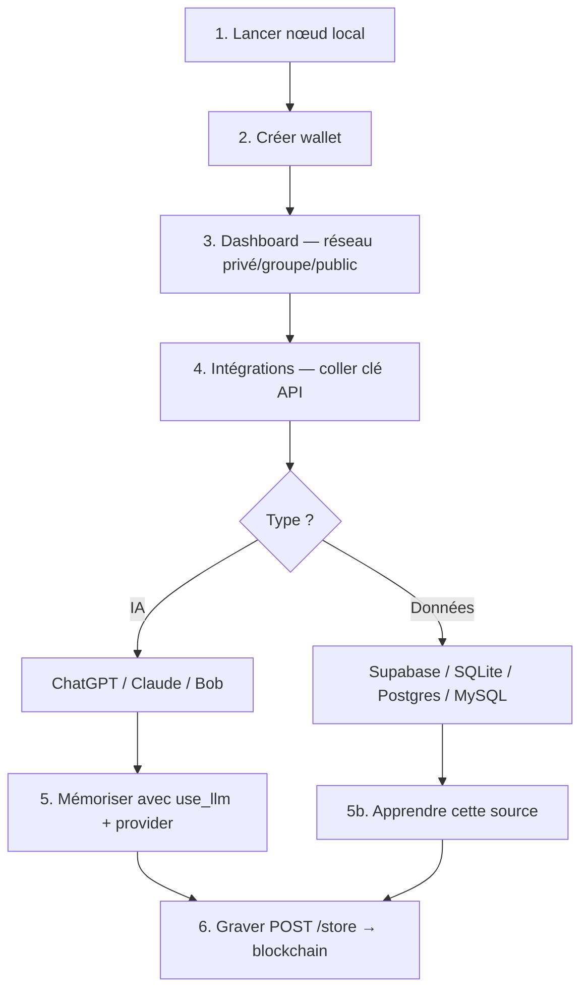

# Rapport 057 — Connexions API utilisateur pour l'apprentissage

**Horodatage :** 2026-07-08T23:20:00Z  
**Branche :** `cursor/connecteurs-api-apprentissage-1fce`  
**Contact :** vgacofficiel@gmail.com  
**Progression globale connecteurs :** **85 %** (MVP codé — Telegram/mail = phase suivante)

---

## 1. Correction de compréhension (erreur rapport précédent)

### Ce que vous demandiez (et que j'avais mal expliqué)

Vous ne demandiez **PAS** :
- de remplacer le stockage ARTCB (JSON local) par Supabase ;
- de stocker les clés API des utilisateurs sur Supabase ou un cloud ARTCB ;
- une « clé API ARTCB » pour authentifier la blockchain.

Vous demandiez **ceci** :

> L'utilisateur entre dans le dashboard, crée son wallet, est sur la blockchain.  
> Ensuite il veut **connecter SA base de données** et **SON IA** (ChatGPT, Claude, etc.)  
> via **les clés API que ces plateformes lui ont fournies**, pour que l'agent **apprenne**  
> depuis ces sources et grave le résultat sur la blockchain ARTCB.

| Rôle | Quoi | Où ça reste |
|------|------|---------------|
| **Blockchain ARTCB** | Graphes IR, blocs, PoL, rewards | `data/` local (inchangé) |
| **Clés API utilisateur** | OpenAI, Anthropic, Supabase client… | `data/connectors/` **chiffré local** |
| **Base du client** | Source d'apprentissage (lecture seule) | Chez le client (Supabase, Postgres, SQLite…) |
| **IA du client** | Enrichissement / classification | API OpenAI, Anthropic, Bob |

---

## 2. Parcours utilisateur réel — étape par étape



### Étape 1 — Entrer dans le système (sans cloud ARTCB)

```bash
cd ~/ARTCB/lvx
export ARTCB_WALLET_PASSPHRASE="votre_phrase_12_car_min"
bash scripts/run_real_local.sh
```

Ouvrir : `http://localhost:5173`

### Étape 2 — Wallet + blockchain

1. **Wallets** → créer un wallet → sélectionner comme acteur  
2. Footer → choisir **PRIVÉ / GROUPE / PUBLIC**  
3. La chaîne est visible dans **Chaîne**

### Étape 3 — Connecter son IA (ChatGPT, Claude…)

**Dashboard → Intégrations** (`/integrations`)

| Fournisseur | Clé à coller | Où l'obtenir |
|-------------|--------------|--------------|
| **openai** | `sk-…` | [platform.openai.com](https://platform.openai.com/api-keys) |
| **anthropic** | `sk-ant-…` | [console.anthropic.com](https://console.anthropic.com/) |
| **bob** | clé Bob IBM | IBM Bob CLI / hackathon |

La clé est **chiffrée AES-256-GCM** dans `data/connectors/connectors.json` sur **votre disque**.

### Étape 4 — Connecter sa base de données (source d'apprentissage)

Toujours dans **Intégrations** :

| Type | Ce que vous fournissez | Usage |
|------|------------------------|-------|
| **supabase** | URL projet + clé API + nom table | Lecture REST des lignes client |
| **sqlite** | chemin `.db` + table + colonne texte | Lecture fichier local |
| **postgres** | connection string + table | Lecture seule |
| **mysql** | connection string + table | Lecture seule |

**Important :** ARTCB **lit** votre base pour apprendre. Il ne **remplace pas** votre base ni la sienne par la vôtre.

### Étape 5 — Lancer l'apprentissage

**Option A — Texte + IA connectée**

1. **Mémoriser** → cocher `use_llm`  
2. Choisir le provider (`openai`, `anthropic`, `bob`) — via API :

```bash
curl -X POST http://127.0.0.1:8000/api/v1/agents/run \
  -H "Content-Type: application/json" \
  -d '{
    "text": "Votre contenu…",
    "use_llm": true,
    "llm_provider": "openai"
  }'
```

**Option B — Depuis votre base connectée**

1. **Intégrations** → sur une source → **Apprendre cette source**  
2. Ou API :

```bash
curl -X POST http://127.0.0.1:8000/api/v1/connectors/conn_XXX/learn \
  -H "Content-Type: application/json" \
  -d '{"connector_id":"conn_XXX","use_llm":true,"llm_provider":"openai","limit":50}'
```

### Étape 6 — Graver sur la blockchain

**Mémoriser** → **Graver sur la chaîne**  
ou `POST /api/v1/store` avec `visibility` : `private` | `group` | `public`

---

## 3. API connecteurs — référence

| Endpoint | Méthode | Description |
|----------|---------|-------------|
| `/api/v1/connectors` | GET | Liste (clés masquées `sk-t…xyz`) |
| `/api/v1/connectors` | POST | Enregistrer clé API chiffrée |
| `/api/v1/connectors/{id}` | DELETE | Déconnecter |
| `/api/v1/connectors/{id}/test` | POST | Tester la connexion |
| `/api/v1/connectors/{id}/learn` | POST | Apprendre depuis source données |
| `/api/v1/agents/run` | POST | `llm_provider` optionnel |

### Exemple — connecter ChatGPT

```json
POST /api/v1/connectors
{
  "provider": "openai",
  "label": "Mon ChatGPT",
  "api_key": "sk-xxxxxxxx",
  "config": { "model": "gpt-4o-mini" }
}
```

### Exemple — connecter Supabase client (lecture table)

```json
POST /api/v1/connectors
{
  "provider": "supabase",
  "label": "Ma base produit",
  "api_key": "eyJhbGciOiJIUzI1NiIs…",
  "config": {
    "project_url": "https://abcdef.supabase.co",
    "table": "documents"
  }
}
```

---

## 4. Ce qui est RÉALISÉ vs PAS ENCORE RÉALISÉ

### ✅ Réalisé dans ce rapport (code livré)

| Composant | Statut | Fichiers |
|-----------|--------|----------|
| Stockage clés chiffré local | ✅ | `src/artcb/connectors/manager.py` |
| OpenAI / Anthropic / Bob | ✅ | `src/artcb/connectors/llm_router.py` |
| Sources : Supabase REST, SQLite | ✅ | `src/artcb/connectors/sources.py` |
| Sources : Postgres, MySQL | ✅ | optionnel `psycopg2-binary`, `pymysql` |
| API REST connecteurs | ✅ | `src/api/connectors_routes.py` |
| Apprentissage depuis source | ✅ | `POST …/learn` |
| UI Dashboard Intégrations | ✅ | `frontend/src/pages/Integrations.tsx` |
| `llm_provider` sur agents/run | ✅ | `src/api/routes.py` |
| Tests | ✅ | `tests/test_connectors.py` |

### ❌ Pas encore réalisé (honnêteté)

| Composant | % | Pourquoi pas encore fait |
|-----------|---|--------------------------|
| **Telegram** notifications | 0 % | Nécessite bot token + worker webhook — pas de module `notifiers/` |
| **Gmail / Outlook** mail | 0 % | OAuth2 Google/Microsoft — flux UI consentement à coder |
| **Slack / Discord** | 0 % | Webhooks entrants — même module notifiers |
| **UI Mémoriser** sélecteur IA | 30 % | API prête ; dropdown provider à ajouter dans Memorize.tsx |
| **P2P multi-nœuds** | 0 % | Hors connecteurs — sync `blocks.jsonl` entre nœuds (`RESEAU_DEVNET_ARTCB`) |
| **ML-KEM transport P2P** | 0 % | Dépend du P2P ; chiffre le transport entre nœuds, pas les clés OpenAI |
| **UI Gouvernance Voter** | 0 % | API vote existe ; page React absente |

### Pourquoi « hors scope » ne veut pas dire « impossible »

| Élément | Raison technique |
|---------|------------------|
| **P2P** | Aucun code libp2p/gossip — un seul fichier `blocks.jsonl` par machine aujourd'hui |
| **ML-KEM** | Signatures PQC faites ; échange de clés session entre nœuds = couche réseau non démarrée |
| **Telegram/mail** | Connecteurs **sortants** (notifications) ≠ connecteurs **entrants** (apprentissage) — module différent |

---

## 5. Plateformes — clé API ou autre ?

| Plateforme | Type connexion | Rôle dans ARTCB | Statut |
|------------|----------------|-----------------|--------|
| **OpenAI (ChatGPT)** | Clé API `sk-…` | IA enrichissement | ✅ |
| **Anthropic (Claude)** | Clé API `sk-ant-…` | IA enrichissement | ✅ |
| **IBM Bob** | Clé API Bob | IA enrichissement | ✅ |
| **Supabase** | URL + clé (lecture) | Source apprentissage | ✅ |
| **PostgreSQL** | Connection string | Source apprentissage | ✅* |
| **MySQL** | Connection string | Source apprentissage | ✅* |
| **SQLite** | Chemin fichier | Source apprentissage | ✅ |
| **Telegram** | Bot token `@BotFather` | Alertes (bloc, vote…) | ❌ à venir |
| **Gmail** | OAuth2 ou app password | Alertes email | ❌ à venir |
| **Outlook** | Microsoft Graph OAuth | Alertes email | ❌ à venir |
| **Slack / Discord** | Webhook URL | Alertes équipe | ❌ à venir |
| **Webhook custom** | URL + secret HMAC | Zapier, n8n | ❌ à venir |

\* `pip install psycopg2-binary` ou `pymysql` si besoin.

**Règle :** chaque plateforme a **sa propre** clé. ARTCB fournit l'**interface** pour les saisir et les garde **chiffrées localement**.

---

## 6. Sécurité des clés utilisateur

| Mesure | Détail |
|--------|--------|
| Chiffrement | AES-256-GCM (`ARTCBENC1`) — même pipeline que wallets |
| Passphrase | `ARTCB_WALLET_PASSPHRASE` (min 12 car.) |
| Fichier | `data/connectors/connectors.json` — permissions `0600` |
| API | Ne renvoie que `api_key_masked` (`sk-t…xyz`) |
| Cloud ARTCB | **Aucun envoi** — tout reste sur la machine utilisateur |

---

## 7. Avant / après cette implémentation

| | Avant | Après |
|---|-------|-------|
| Clés OpenAI/Claude dans UI | ❌ Seulement `.env` serveur (Bob) | ✅ Dashboard Intégrations |
| Apprendre depuis DB client | ❌ | ✅ `POST …/learn` |
| Supabase comme source | ❌ Confondu avec stockage ARTCB | ✅ Lecture table client uniquement |
| Page Intégrations | ❌ CDC futur | ✅ `/integrations` |
| Tests connecteurs | 0 | +4 tests |

---

## 8. Commandes vérification

```bash
cd ~/ARTCB/lvx
git pull origin cursor/connecteurs-api-apprentissage-1fce  # ou main après merge
export ARTCB_WALLET_PASSPHRASE="votre_phrase_12_car_min"
python3 -m pytest tests/test_connectors.py -q
# Dashboard : http://localhost:5173/integrations
```

---

## 9. Prochaines étapes recommandées

1. Sélecteur IA dans **Mémoriser** (OpenAI / Claude / rule-based)  
2. Module **notifications** : Telegram, SMTP, webhooks  
3. P2P `artcb-devnet` + ML-KEM transport  
4. UI **Gouvernance → Voter**

---

**© 2026 VGACTech — vgacofficiel@gmail.com**

*Rapport 057 — ne pas écraser. Correction explicite de l'interprétation erronée du rapport chat précédent.*
