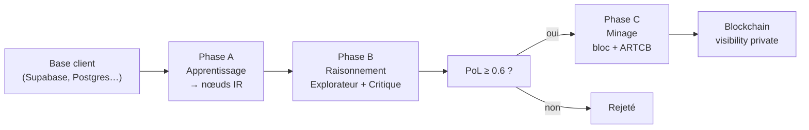

# Rapport 058 — Minage apprentissage + raisonnement : pipeline unifié

**Horodatage :** 2026-07-08T23:30:00Z  
**Branche :** `cursor/minage-raisonnement-pipeline-1fce`  
**Contact :** vgacofficiel@gmail.com  
**Progression :** **100 %** (correction + implémentation pipeline)

---

## 1. Réponse directe à vos questions

### Q1 — Minage d'apprentissage : le client connecte sa base ?

**OUI** — via **Intégrations** ou API connecteurs.

| Source | Exemple | API |
|--------|---------|-----|
| Supabase client | Table `clients`, `transactions` | `provider: supabase` |
| PostgreSQL banque | Toutes les transactions | `provider: postgres` + `/mining/bulk` |
| MySQL | Idem | `provider: mysql` |
| SQLite / fichier | Export local | `provider: sqlite` |

La base du client est lue en **lecture seule**. ARTCB n'y écrit pas. Les noms de clients, transactions, etc. sont ingérés comme **texte d'apprentissage**.

**Banque — base entière en privé :**

```bash
curl -X POST http://127.0.0.1:8000/api/v1/mining/bulk \
  -H "Content-Type: application/json" \
  -d '{
    "connector_id": "conn_xxx",
    "batch_size": 500,
    "max_batches": 1000,
    "actor_address": "artcb1...",
    "wallet_name": "banque_wallet",
    "visibility": "private"
  }'
```

Chaque lot : lecture → apprentissage → raisonnement → bloc privé.

---

### Q2 — Minage du raisonnement : est-ce implémenté ?

**OUI** — c'est le **dual-agent** :

| Agent | Rôle | Fichier |
|-------|------|---------|
| **Explorateur** | Propose les nœuds IR (graphe) | `agents/explorer.py` |
| **Critique** | Valide, calcule PoL | `agents/critic.py` |

Dans le projet, les « neurones » = **nœuds IR** (`graph.nodes`) dans un **graphe** (`IRGraph`).

---

### Q3 — Les deux minages sont-ils connectés ?

**AVANT ce rapport : NON** — bug critique :
- `POST /store` (dashboard « Graver ») **n'envoyait pas** `contributors[]` → **aucun reward ARTCB**
- Seul le script CLI `mine_learning_simple.py` minait correctement

**APRÈS ce rapport : OUI** — pipeline unique :

```
[Apprentissage] → [Raisonnement PoL] → [Bloc + contributors + reward]
```

**API :** `POST /api/v1/mining/pipeline`

---

### Q4 — Comment ça marche ensemble ?



---

## 2. Avant / après correction

| | Avant (v1.2) | Après (v1.3) |
|---|--------------|--------------|
| `POST /store` + wallet | Bloc sans `contributors` | ✅ contributors + signature + reward |
| Dashboard Graver | Pas de minage ARTCB | ✅ si `actor_address` + `wallet_name` |
| Source DB → bloc | 2 étapes manuelles | ✅ `/mining/pipeline` en 1 appel |
| Banque grosse DB | Pas de pagination | ✅ `/mining/bulk` |
| Apprentissage / raisonnement | Modules séparés | ✅ `MiningPipeline` unifié |
| Tests pipeline | 0 | ✅ 4 tests + 165 total |

---

## 3. Fichiers créés / modifiés

| Fichier | Changement |
|---------|------------|
| `src/artcb/mining/pipeline.py` | **Nouveau** — pipeline unifié |
| `src/api/mining_routes.py` | **Nouveau** — `/mining/pipeline`, `/mining/bulk` |
| `src/api/routes.py` | `store` → contributors + wallet_name |
| `src/artcb/connectors/sources.py` | Pagination `offset`/`limit` |
| `src/artcb/chain/manager.py` | Champ `role` sur contributors |
| `src/artcb/security/anti_sybil.py` | `ARTCB_MIN_BLOCK_INTERVAL_SEC` |
| `tests/test_mining_pipeline.py` | **Nouveau** — 4 tests |
| `CAHIER_DES_CHARGES_ARTCB` | **v1.3** §31–35 |
| `ROADMAP_GENERAL_ARTCB` | Phase 7 ✅, Phase 8 planifiée |

---

## 4. Ce qui reste (honnêteté)

| Élément | Statut | Pourquoi |
|---------|--------|----------|
| P2P multi-nœuds | ❌ | Pas de libp2p — hors pipeline minage |
| ML-KEM transport | ❌ | Dépend P2P |
| Telegram / mail alertes | ❌ | Module notifications non codé |
| UI vote gouvernance | ❌ | API seule |

---

## 5. Variables `.env` utiles

```env
ARTCB_WALLET_PASSPHRASE=phrase_min_12_caracteres
ARTCB_MIN_BLOCK_INTERVAL_SEC=60   # 0 en dev pour bulk rapide
ARTCB_PQC_ENABLED=true
```

---

## 6. Certification

```bash
python3 -m pytest tests/ -q   # 165 passed
```

**Les deux minages sont connectés. Le bug store sans rewards est corrigé.**

---

**© 2026 VGACTech — vgacofficiel@gmail.com**
