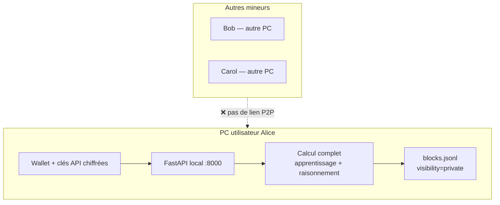
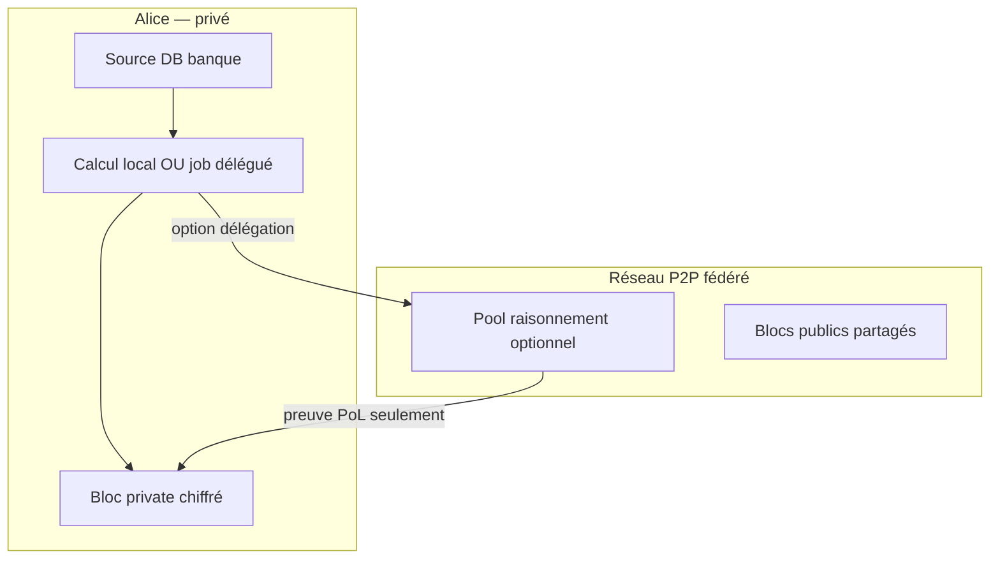

# Rapport 059 — Minage privé, participation des autres mineurs, sécurité

**Horodatage :** 2026-07-08T23:45:00Z  
**Contact :** vgacofficiel@gmail.com  
**Références relues :** `PROTOCOLE_ARTCB`, `AUTO_PROMPT_ARTCB`, `CAHIER_DES_CHARGES_ARTCB` v1.3, `TOKENOMICS_ARTCB`, `RESEAU_DEVNET_ARTCB`  
**Progression réseau multi-mineurs :** **0 %** (single-node) | **Progression minage local :** **~85 %**

---

## 1. État du dépôt distant — OUI, `main` est à jour

| Vérification | Résultat |
|--------------|----------|
| Branche locale | `main` |
| `origin/main` | **identique** à local |
| Commit HEAD | `3d9e9e9` — `feat(mining): pipeline unifié apprentissage + raisonnement + rewards` |
| Working tree | propre (rien à committer) |

**Historique récent sur `https://github.com/vgac2025/lvx` (branche `main`) :**

```
3d9e9e9 feat(mining): pipeline unifié apprentissage + raisonnement + rewards
1e08bf1 feat(connectors): clés API IA + sources apprentissage — UI Intégrations
d5b17c2 feat(security): PQC ML-DSA-65 hybride + gouvernance vote API
192ed44 feat(security): AES-256-GCM wallet keys + métriques avant/après
```

**Sur votre PC :**

```bash
cd ~/ARTCB/lvx
git pull origin main
# Attendu : HEAD = 3d9e9e9
```

---

## 2. Question centrale — Les autres mineurs participent-ils au calcul ?

### Réponse courte : **NON, pas aujourd'hui**

Quand un utilisateur :
1. crée son wallet ;
2. connecte Claude / ChatGPT / autre via **Intégrations** ;
3. entraîne sur **`visibility: private`** ;

→ **Tout le calcul** (lecture DB, encodage IR, dual-agent Explorateur/Critique, appels API IA) s'exécute **sur SA machine** (son nœud local FastAPI).

**Aucun autre mineur** sur le réseau :
- ne reçoit ses données privées ;
- ne participe au calcul d'apprentissage ;
- ne participe au calcul de raisonnement ;
- ne voit ses clés API OpenAI / Claude / OpenRouter.

**Pourquoi :** il n'existe **pas encore** de réseau P2P `artcb-devnet` (`RESEAU_DEVNET_ARTCB` — spec seulement, **0 % code**). Chaque installation = **un fichier** `data/chain/blocks.jsonl` sur **un disque local**.

---

## 3. Deux sens différents de « collectif » — ne pas confondre

### A) Reward collectif PoL (✅ implémenté)

| Aspect | Détail |
|--------|--------|
| **C'est quoi ?** | Plusieurs **adresses wallet** peuvent figurer dans `contributors[]` d'**un même bloc** |
| **Effet** | Le reward ARTCB du bloc est **partagé** proportionnellement aux scores PoL (`PolScorer.split_reward`) |
| **Où ?** | `src/artcb/chain/manager.py` L237–249, `src/artcb/pol/scorer.py` |
| **Calcul distribué ?** | **Non** — un seul nœud a fait tout le travail, puis déclare plusieurs contributeurs |

**Exemple :** Alice et Bob ont tous deux validé des parties d'un graphe → un bloc avec 2 `contributors` → split 60/40 du reward.

### B) Calcul distribué multi-mineurs (❌ pas implémenté)

| Aspect | Détail |
|--------|--------|
| **C'est quoi ?** | D'autres nœuds du réseau exécutent une partie du LLM, du raisonnement ou de l'ingestion |
| **Comme Bitcoin ?** | Pools de mineurs qui hashent en parallèle — **ce modèle n'existe pas** dans ARTCB |
| **Statut** | Nécessite P2P + protocole de jobs + preuves — **Phase 8 roadmap** |

---

## 4. Schéma — Aujourd'hui vs cible future

### Aujourd'hui (single-node)



### Cible future (artcb-devnet — à valider par vous)



---

## 5. Réseau PRIVÉ — effets concrets

| Question | Réponse aujourd'hui |
|----------|---------------------|
| Qui voit les blocs `private` ? | **Uniquement** le nœud qui les a écrits (fichier local) |
| Les autres mineurs voient-ils le contenu ? | **Non** — ils n'ont même pas accès au fichier |
| Les clés API Claude/OpenAI partent où ? | De **votre** serveur local → API du fournisseur (OpenAI, Anthropic…) |
| OpenRouter ? | **Pas encore** connecteur dédié — ajout possible (`provider: openrouter`) |
| Les données banque quittent-elles le PC ? | **Seulement** si vous appelez une API cloud IA — pas vers ARTCB cloud (inexistant) |
| Reward ARTCB en privé ? | **Oui** — crédité sur **votre** wallet dans **votre** chaîne locale |

### Effets si NON-participation des autres mineurs (situation actuelle)

| ✅ Avantages | ⚠️ Limites |
|-------------|-----------|
| Confidentialité maximale (banque, santé…) | Pas de mutualisation de puissance calcul |
| Clés API jamais partagées avec pairs | Un seul CPU/GPU par utilisateur |
| Conformité RGPD plus simple (données locales) | Pas de « pool » pour grosses bases |
| Pas de fuite réseau des transactions privées | Blockchain pas décentralisée à 100 % (PROTOCOLE cible) |

---

## 6. Si d'autres mineurs participaient — effets possibles (futur)

**À implémenter — nécessite votre validation GO**

| Scénario | Effet positif | Risque sécurité |
|----------|---------------|-----------------|
| **Pool raisonnement public** | Calcul plus rapide sur gros volumes | Fuite de métadonnées / fragments de texte |
| **Fédération groupe** | Membres d'un `group_id` co-minent | Fuite entre membres du groupe |
| **Délégation privée chiffrée** | GPU distant sans voir le clair | Complexité crypto (ML-KEM, TEE…) |
| **Sync P2P blocs publics** | Chaîne mondiale vérifiable | Hors scope blocs `private` |

**Règle de sécurité proposée pour le futur :**

> Les blocs `visibility: private` **ne doivent jamais** être synchronisés en clair sur le réseau P2P.  
> Seuls hash + preuves PoL, ou chiffrement bout-en-bout avec clé wallet, seraient envisageables.

---

## 7. Sécurité — ce qui est possible / impossible / envisageable

### ✅ Possible aujourd'hui (réel, testé)

| Mesure | Détail |
|--------|--------|
| Wallet chiffré AES-256-GCM | `data/wallets/*.key`, `.pqc` |
| Clés API IA chiffrées localement | `data/connectors/connectors.json` |
| Signatures hybrides Ed25519 + ML-DSA | Blocs et join-requests |
| Anti-Sybil + Slashing | Limite fréquence blocs, réputation |
| Apprentissage lecture seule DB client | Pas d'écriture dans la base du client |
| Minage privé 100 % local | `visibility: private` |

### ❌ Impossible aujourd'hui (honnêteté)

| Affirmation | Réalité |
|-------------|---------|
| « La chaîne est décentralisée à 100 % » | **Non** — single-node (`PROTOCOLE` = objectif, pas état actuel) |
| « D'autres mineurs aident mon calcul privé » | **Non** |
| « Mes blocs privés sont sur le réseau mondial » | **Non** — fichier local |
| « OpenRouter connecteur UI » | **Non** — à coder si vous validez |
| « Mes clés API sont sur Supabase ARTCB » | **Non** — jamais, par design |

### 🔮 Envisageable (à valider — pas encore codé)

| Fonctionnalité | Effort technique | Priorité suggérée |
|----------------|------------------|-------------------|
| Connecteur **OpenRouter** (multi-modèles) | Faible | P1 |
| **P2P artcb-devnet** 2+ nœuds | Élevé | P0 réseau |
| **ML-KEM** transport inter-nœuds | Moyen | P1 (après P2P) |
| Pool calcul **opt-in** pour blocs publics | Élevé | P2 |
| Minage groupe : co-contributeurs signés | Moyen | P1 |
| TEE / enclave pour délégation privée | Très élevé | P3 |
| ZK proof : prouver PoL sans révéler données | Recherche | P3 |

---

## 8. OpenRouter, Claude, ChatGPT — qui fait le calcul ?

| Fournisseur | Connecteur ARTCB | Où tourne le LLM ? |
|-------------|------------------|-------------------|
| **OpenAI (ChatGPT)** | ✅ `provider: openai` | Serveurs OpenAI |
| **Anthropic (Claude)** | ✅ `provider: anthropic` | Serveurs Anthropic |
| **IBM Bob** | ✅ `provider: bob` | API Bob IBM |
| **OpenRouter** | ❌ pas encore | — |
| **Rule-based (sans IA)** | ✅ toujours dispo | 100 % local |

**Important :** même avec Claude/OpenAI, le **raisonnement ARTCB** (Explorateur + Critique + PoL) tourne **sur votre nœud**. Seul l'enrichissement LLM des types de nœuds appelle l'API externe.

**Implication sécurité banque :** si vous interdisez toute fuite cloud, utilisez **`use_llm: false`** (rule-based seul) — tout reste sur votre machine.

---

## 9. Questions que vous devriez vous poser (checklist validation)

Cochez ce que vous voulez que j'implémente :

| # | Question | Réponse actuelle | Implémenter ? |
|---|----------|------------------|---------------|
| Q1 | Un autre mineur voit-il mes blocs privés ? | **Non** | — |
| Q2 | Un autre mineur m'aide-t-il à calculer ? | **Non** | P2P pool si GO |
| Q3 | Plusieurs wallets partagent-ils un reward sur 1 bloc ? | **Oui** (contributors[]) | — |
| Q4 | Ma clé OpenAI quitte-t-elle mon PC ? | Vers OpenAI seulement | — |
| Q5 | OpenRouter en connecteur UI ? | **Non** | ☐ GO utilisateur |
| Q6 | Banque — toute la DB en privé local ? | **Oui** (`/mining/bulk`) | — |
| Q7 | Calcul distribué pour grosses bases ? | **Non** | ☐ GO utilisateur |
| Q8 | Blocs privés jamais sync P2P en clair ? | Règle proposée | ☐ GO utilisateur |
| Q9 | IA 100 % locale sans cloud ? | Rule-based ou modèle local | ☐ GO Ollama/LM Studio |
| Q10 | Décentralisation 100 % (PROTOCOLE) ? | **0 %** P2P | ☐ GO Phase 8 |

---

## 10. Ce qu'il faudrait coder pour que d'autres mineurs participent

**Uniquement si vous validez — pas de dev sans GO**

### Phase A — Réseau (prérequis)

1. `artcb-devnet` — libp2p ou gossip custom (`ARTCB_P2P_PORT=18444`)
2. Sync blocs **publics** uniquement entre nœuds
3. ML-KEM sur transport P2P

### Phase B — Calcul partagé (opt-in)

1. Protocole **MiningJob** : `{ job_id, graph_root_hash, chunk_hash, pol_threshold }`
2. Workers pairs exécutent Critique sur un chunk
3. Preuve de contribution signée → `contributors[]`
4. **Jamais** envoyer texte clair pour jobs `private` sans chiffrement E2E

### Phase C — Connecteurs

1. `openrouter` dans `ConnectorManager`
2. `ollama` / `lmstudio` pour IA 100 % locale

---

## 11. Avant / après compréhension (ce rapport)

| Sujet | Erreur fréquente | Vérité code |
|-------|------------------|------------|
| « Collectif » | = calcul distribué | = **split reward** sur un bloc |
| « Privé » | = sur le réseau mais caché | = **fichier local**, invisible aux autres |
| « Mineurs connectés » | = pool comme Bitcoin | = **n'existe pas** sans P2P |
| « OpenRouter » | = déjà dans UI | = **à ajouter** |
| « main GitHub » | = pas pushé | = **3d9e9e9** sur `origin/main` ✅ |

---

## 12. Recommandation VGACTech (pour validation)

| Priorité | Action | Raison |
|----------|--------|--------|
| **P0** | Garder minage privé **100 % local** pour banques | Sécurité / conformité |
| **P1** | Ajouter connecteur **OpenRouter** | Demande utilisateur fréquente |
| **P1** | Documenter dans UI : « calcul local, pas de pool » | Éviter confusion |
| **P2** | P2P devnet blocs **publics** seulement | Vers PROTOCOLE décentralisé |
| **P3** | Pool calcul privé chiffré | Recherche, pas MVP |

---

## 13. Fichiers source cités

| Fichier | Lignes / rôle |
|---------|---------------|
| `src/artcb/mining/pipeline.py` | Pipeline local apprentissage → raisonnement → bloc |
| `src/artcb/chain/manager.py` | L237–249 split reward `contributors[]` |
| `src/artcb/connectors/manager.py` | Clés API chiffrées locales |
| `RESEAU_DEVNET_ARTCB` | Spec P2P — non codé |
| `TOKENOMICS_ARTCB` §2 | Mineurs d'apprentissage vs rail utilitaire |

---

**© 2026 VGACTech — vgacofficiel@gmail.com**

*Rapport 059 — à valider : cochez §9 ce que vous voulez implémenter ensuite.*
