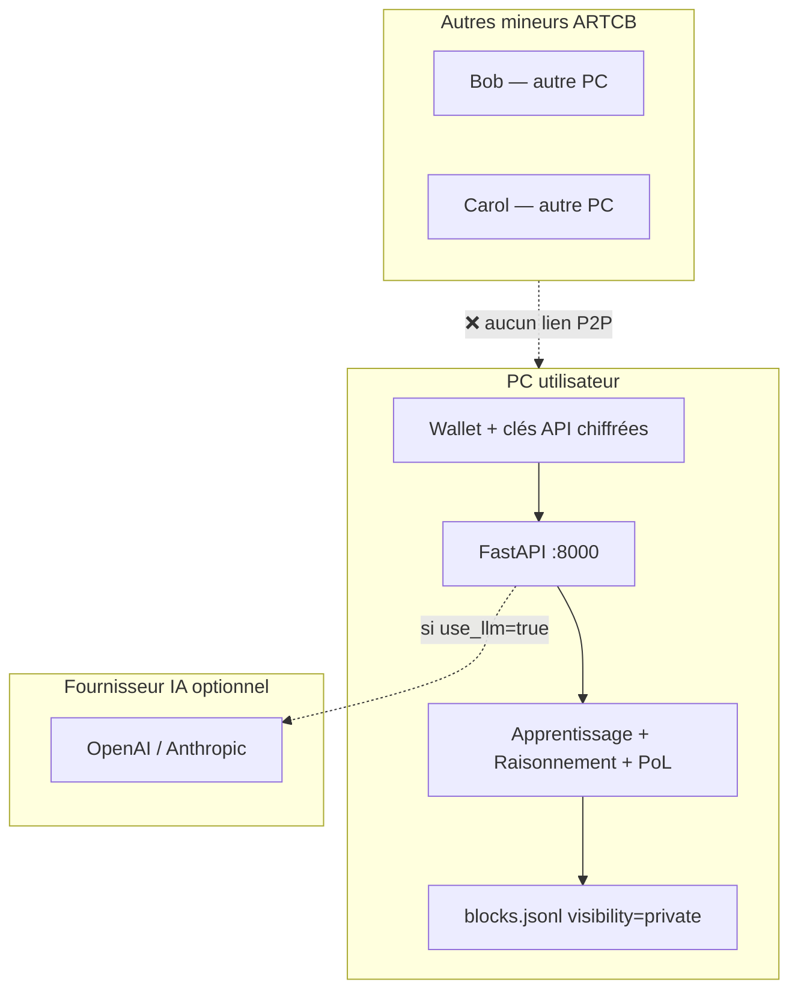
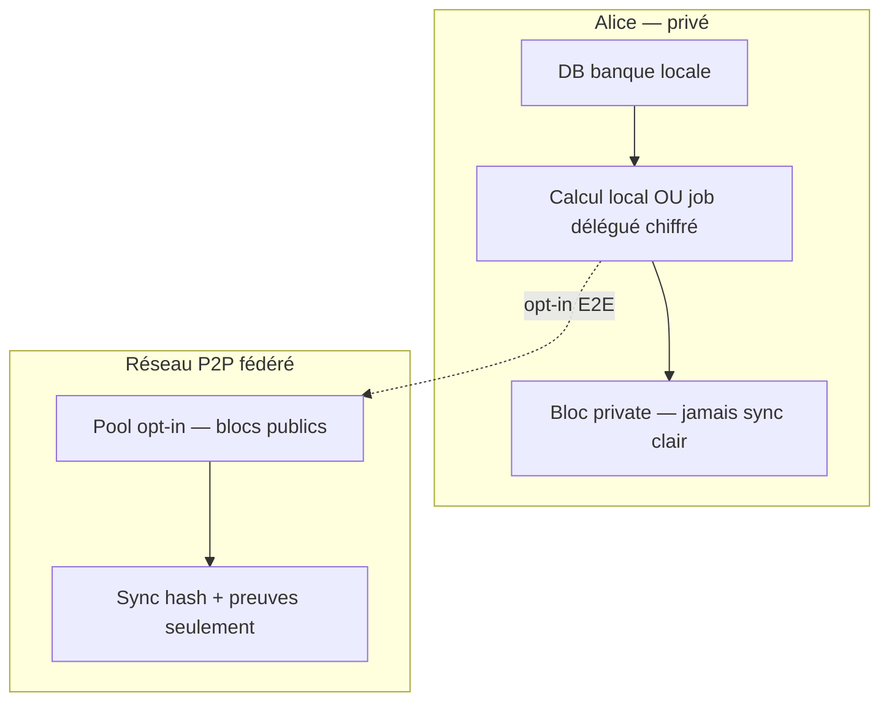

# Rapport 060 — Validation : push `main`, minage privé, mineurs, sécurité

**Horodatage :** 2026-07-08T23:55:00Z  
**Contact :** vgacofficiel@gmail.com  
**Documents relus avant réponse :** `PROTOCOLE_ARTCB`, `AUTO_PROMPT_ARTCB`, `CAHIER_DES_CHARGES_ARTCB` v1.3 (§31–35), `TOKENOMICS_ARTCB`, `RESEAU_DEVNET_ARTCB`, `GROUPES_RESEAUX_ARTCB`, `GOUVERNANCE_ARTCB`  
**Complète :** `rapports/059_minage_prive_multi_mineurs_securite.md` (détail technique)  
**Progression :** dépôt distant **100 %** | P2P multi-mineurs **0 %** | minage local **~85 %** | tests **165/165** ✅

---

## 1. Réponse directe — Push et mise à jour du `main` distant

### **OUI** — le dépôt distant est à jour

| Vérification (2026-07-08) | Résultat |
|---------------------------|----------|
| Branche locale | `main` |
| `origin/main` | **identique** à local (`## main...origin/main` — aucun commit en avance/retard) |
| Commit HEAD | `605fbd4` — `docs: rapport 059 minage privé multi-mineurs sécurité` |
| Working tree | propre |
| Tests | **165 pytest** passés |

**Historique récent sur `https://github.com/vgac2025/lvx` (branche `main`) :**

```
605fbd4 docs: rapport 059 minage privé multi-mineurs sécurité
3d9e9e9 feat(mining): pipeline unifié apprentissage + raisonnement + rewards
1e08bf1 feat(connectors): clés API IA + sources apprentissage — UI Intégrations
d5b17c2 feat(security): PQC ML-DSA-65 hybride + gouvernance vote API
192ed44 feat(security): AES-256-GCM wallet keys + métriques avant/après
```

**Sur votre PC :**

```bash
cd ~/ARTCB/lvx
git pull origin main
# Attendu : HEAD = 605fbd4 (ou commit plus récent si ce rapport est déjà poussé)
python3 -m pytest tests/ -q   # attendu : 165 passed
```

> **Note PROTOCOLE :** l'objectif « blockchain décentralisée à 100 % » est documenté comme **cible**, pas comme état actuel du code. Le push `main` concerne le **code + docs** sur GitHub ; la décentralisation réseau reste **0 %** (voir §4).

---

## 2. Parcours utilisateur — ce qui se passe réellement

Scénario typique :

1. L'utilisateur crée un **wallet** (`artcb1…` ou `artcb2…` hybride PQC).
2. Il saisit ses **clés API** (OpenAI, Anthropic, Bob…) dans **Intégrations** (`/integrations`).
3. Il connecte une **source d'apprentissage** (Postgres, Supabase, SQLite, fichiers…).
4. Il lance le **pipeline minage** (`POST /api/v1/mining/pipeline` ou `/mining/bulk`) avec `visibility: private`.
5. Optionnel : il choisit un fournisseur LLM pour enrichir l'apprentissage.

### Où s'exécute chaque étape ?

| Étape | Machine | Données visibles par qui ? |
|-------|---------|----------------------------|
| Création wallet | PC utilisateur | Lui seul (clé chiffrée AES-256-GCM) |
| Stockage clés API IA | PC utilisateur (`data/connectors/`) | Lui seul (chiffré localement) |
| Lecture DB client | PC utilisateur → DB client | Lui + son infra DB |
| Appel Claude / ChatGPT | PC utilisateur → API fournisseur | Fournisseur cloud (si `use_llm: true`) |
| Dual-agent Explorateur/Critique + PoL | **100 % local** (FastAPI) | Personne d'autre |
| Écriture bloc | Fichier local `data/chain/blocks.jsonl` | Personne d'autre (si `private`) |

**Identité on-chain :** c'est l'**adresse wallet**, pas une clé API ARTCB. Les connecteurs servent à **vos** sources et **vos** IA — ils ne remplacent pas le stockage blockchain ARTCB.

---

## 3. Question centrale — Les autres mineurs participent-ils au calcul ?

### Réponse : **NON, pas aujourd'hui**

Quand vous entraînez sur la partie **privée** (`visibility: private`) :

- **Aucun autre mineur** ne reçoit vos données.
- **Aucun autre mineur** n'exécute l'apprentissage ni le raisonnement à votre place.
- **Aucun autre mineur** ne voit vos clés API (OpenAI, Claude, OpenRouter, etc.).
- **Aucun autre mineur** n'a accès à votre fichier `blocks.jsonl`.

**Pourquoi :** il n'existe **pas** de réseau P2P `artcb-devnet` en code (`RESEAU_DEVNET_ARTCB` = spécification seulement). Chaque installation ARTCB = **un nœud isolé** sur **un disque local**.

### Cas `visibility: group`

Même logique **aujourd'hui** :

- Le bloc est tagué `group_id` et filtrable via API (`GET /chain?group_id=…`).
- Il reste stocké sur **le nœud qui l'a produit** — pas de sync automatique vers les autres membres du groupe.
- Seuls les membres **qui ont accès à ce nœud** (ou une copie manuelle du fichier) voient le bloc.
- Le calcul (apprentissage + raisonnement) reste **local** sur la machine qui a lancé le pipeline.

---

## 4. Deux sens de « collectif » — ne pas confondre

### A) Reward collectif PoL — **OUI, implémenté**

| Aspect | Détail |
|--------|--------|
| Mécanisme | Plusieurs adresses dans `contributors[]` d'**un même bloc** |
| Effet | Reward ARTCB **partagé** selon scores PoL (`PolScorer.split_reward`) |
| Rôles | `learner` (ingestion), `reasoner` (dual-agent), `contributor` |
| Calcul distribué ? | **Non** — un seul nœud a tout calculé, puis déclare les contributeurs signés |

**Code :** `src/artcb/mining/pipeline.py` (`build_contributors`), `src/artcb/chain/manager.py` (append + split).

### B) Calcul distribué multi-mineurs — **NON, pas implémenté**

| Aspect | Détail |
|--------|--------|
| Modèle | D'autres nœuds exécutent des morceaux de LLM, raisonnement ou ingestion |
| Analogie Bitcoin | Pool de hash — **n'existe pas** dans ARTCB |
| Statut | Phase 8 roadmap — nécessite P2P + protocole `MiningJob` + preuves |

---

## 5. Effets — participation vs non-participation

### Situation actuelle (NON-participation des autres mineurs)

| ✅ Avantages sécurité / conformité | ⚠️ Limites opérationnelles |
|-----------------------------------|---------------------------|
| Confidentialité maximale (banque, santé, RH…) | Pas de mutualisation CPU/GPU |
| Clés API jamais partagées avec des pairs ARTCB | Un seul hardware par utilisateur |
| Données privées jamais sur un « réseau mondial » ARTCB | Grosses bases = temps proportionnel à la machine locale |
| RGPD / souveraineté plus simples (données restent chez vous) | Décentralisation PROTOCOLE : **0 %** P2P |
| Contrôle total sur `use_llm: false` (100 % rule-based local) | Pas de résilience si le PC tombe (pas de réplicas auto) |

### Si participation future (après votre GO explicite)

| Scénario | Bénéfice | Risque |
|----------|----------|--------|
| Pool raisonnement **public** opt-in | Vitesse sur gros volumes | Fuite métadonnées / fragments |
| Co-minage **groupe** (sync fichiers entre membres) | Partage de graphes entre équipe | Fuite intra-groupe si mal configuré |
| Délégation privée **chiffrée E2E** | GPU distant sans voir le clair | Crypto complexe (ML-KEM, TEE…) |
| Sync P2P blocs **publics** | Chaîne vérifiable multi-nœuds | Hors scope `private` |

**Règle de sécurité proposée (à valider §9) :**

> Les blocs `visibility: private` **ne doivent jamais** être synchronisés en clair sur le réseau P2P.  
> Seuls hash + preuves PoL, ou chiffrement bout-en-bout avec clé wallet, seraient envisageables.

---

## 6. Sécurité — matrice complète

### ✅ Possible aujourd'hui (vérifié dans le code)

| Mesure | Emplacement |
|--------|-------------|
| Wallet chiffré AES-256-GCM | `data/wallets/*.key`, `.pqc` |
| Signatures hybrides Ed25519 + ML-DSA-65 | wallet, blocs, join-requests |
| Clés API IA chiffrées localement | `data/connectors/connectors.json` |
| Anti-Sybil + intervalle min entre blocs | `ARTCB_MIN_BLOCK_INTERVAL_SEC` |
| Apprentissage **lecture seule** sur DB client | `src/artcb/connectors/sources.py` |
| Pipeline privé 100 % local | `src/artcb/mining/pipeline.py` |
| Gouvernance vote API | `POST /api/v1/governance/vote` |
| Join groupe par demande signée (pas d'invite par clé privée) | `join_requests.py`, Solution 2 |

### ❌ Impossible / faux aujourd'hui (honnêteté PROTOCOLE)

| Affirmation | Réalité |
|-------------|---------|
| « La chaîne est décentralisée à 100 % » | **Non** — single-node par installation |
| « D'autres mineurs aident mon calcul privé » | **Non** |
| « Mes blocs privés sont sur le réseau mondial » | **Non** — fichier local |
| « OpenRouter est dans l'UI Intégrations » | **Non** — connecteur à coder |
| « Mes clés API sont sur un cloud ARTCB » | **Non** — jamais, par design |
| « Telegram / Gmail notifient les blocs » | **Non** — pas implémenté |
| « Ollama / LM Studio en connecteur » | **Non** — envisageable |

### 🔮 Envisageable — nécessite votre GO

| Fonctionnalité | Priorité suggérée | Effort |
|----------------|-------------------|--------|
| Connecteur **OpenRouter** | P1 | Faible |
| Disclaimer UI « calcul local, pas de pool » | P1 | Faible |
| **Ollama / LM Studio** (IA 100 % locale) | P1 si banque | Moyen |
| P2P `artcb-devnet` (blocs publics) | P0 réseau | Élevé |
| ML-KEM transport inter-nœuds | P1 | Moyen |
| Pool calcul opt-in blocs publics | P2 | Élevé |
| UI Gouvernance « Voter » | P2 | Moyen |
| ZK / TEE délégation privée | P3 | Recherche |

---

## 7. Fournisseurs IA — qui calcule quoi ?

| Fournisseur | Connecteur ARTCB | Où tourne le LLM ? | Données envoyées |
|-------------|------------------|--------------------|------------------|
| **OpenAI (ChatGPT)** | ✅ `openai` | Serveurs OpenAI | Extraits de phrases pour classification IR |
| **Anthropic (Claude)** | ✅ `anthropic` | Serveurs Anthropic | Idem |
| **IBM Bob** | ✅ `bob` | API Bob IBM | Idem |
| **OpenRouter** | ❌ pas encore | — | — |
| **Rule-based (sans IA)** | ✅ toujours | 100 % local | Rien vers le cloud |

**Point critique :** même avec Claude/OpenAI, le **raisonnement ARTCB** (Explorateur + Critique + scoring PoL + signature bloc) tourne sur **votre nœud**. Seule la **classification LLM** des phrases lors de l'apprentissage appelle l'API externe.

**Pour une banque qui interdit tout cloud :** `use_llm: false` — pipeline rule-based uniquement, zéro appel externe.

**Fichier source :** `src/artcb/connectors/llm_router.py` L35–43 — providers supportés : `openai`, `anthropic`, `bob` uniquement.

---

## 8. Schéma — aujourd'hui vs cible

### Aujourd'hui



### Cible future (si validée)



---

## 9. Checklist validation — cochez ce que vous voulez implémenter

| # | Question | Réponse actuelle | Implémenter ? |
|---|----------|------------------|---------------|
| Q1 | Un autre mineur voit-il mes blocs `private` ? | **Non** | — |
| Q2 | Un autre mineur m'aide-t-il à calculer ? | **Non** | ☐ Pool P2P si GO |
| Q3 | Plusieurs wallets partagent-ils un reward sur 1 bloc ? | **Oui** (`contributors[]`) | — |
| Q4 | Ma clé OpenAI quitte-t-elle mon PC ? | Vers le fournisseur IA seulement | — |
| Q5 | Connecteur **OpenRouter** dans l'UI ? | **Non** | ☐ GO |
| Q6 | Banque — toute la DB en privé local ? | **Oui** (`/mining/bulk`) | — |
| Q7 | Calcul distribué pour grosses bases ? | **Non** | ☐ GO |
| Q8 | Blocs privés jamais sync P2P en clair ? | Règle proposée | ☐ GO règle |
| Q9 | IA 100 % locale (Ollama / LM Studio) ? | **Non** (rule-based oui) | ☐ GO |
| Q10 | Décentralisation 100 % (PROTOCOLE) ? | **0 %** P2P | ☐ GO Phase 8 |
| Q11 | Disclaimer UI « pas de pool de calcul » ? | **Non** | ☐ GO |
| Q12 | UI Gouvernance vote (API existe) ? | **Non** | ☐ GO |
| Q13 | Notifications Telegram / email ? | **Non** | ☐ GO |

**Répondez dans le chat ou par email** (`vgacofficiel@gmail.com`) avec les numéros cochés — **aucun développement sans GO explicite** (AUTO_PROMPT § post audit v1.1).

---

## 10. Ce qu'il faudrait coder (uniquement si GO)

### Phase A — Réseau (prérequis multi-mineurs)

1. `artcb-devnet` — libp2p ou gossip (`ARTCB_P2P_PORT=18444`)
2. Sync blocs **publics** uniquement
3. ML-KEM sur transport P2P

### Phase B — Calcul partagé opt-in

1. Protocole `MiningJob` : `{ job_id, graph_root_hash, chunk_hash, pol_threshold }`
2. Workers pairs exécutent Critique sur un chunk
3. Preuve signée → entrée `contributors[]`
4. Jobs `private` : **jamais** de texte clair sans chiffrement E2E

### Phase C — Connecteurs (demandes fréquentes)

1. `openrouter` dans `ConnectorManager` + `LLMRouter`
2. `ollama` / `lmstudio` pour IA locale sans cloud
3. Sélecteur fournisseur LLM dans UI Memorize (API prête)

---

## 11. Avant / après — clarifications demandées

| Sujet | Erreur fréquente | Vérité code |
|-------|------------------|------------|
| « Collectif » | = calcul distribué type Bitcoin | = **split reward** PoL sur un bloc |
| « Privé » | = sur le réseau mais caché | = **fichier local**, invisible aux autres nœuds |
| « Mineurs connectés » | = pool qui calcule pour moi | = **n'existe pas** sans P2P |
| « OpenRouter » | = déjà dans Intégrations | = **à ajouter** si GO |
| « Push main GitHub » | = pas fait | = **605fbd4** sur `origin/main` ✅ |
| « Entraîner = autres mineurs minent » | oui par défaut | = **non** — tout est local |
| « Clé API ARTCB = identité » | oui | = **non** — identité = **wallet** |

---

## 12. Recommandation VGACTech (en attente de votre validation)

| Priorité | Action | Raison |
|----------|--------|--------|
| **P0** | Conserver minage privé **100 % local** pour secteurs sensibles | Sécurité, RGPD, souveraineté |
| **P1** | Connecteur **OpenRouter** + disclaimer UI | Demandes utilisateur + clarté |
| **P1** | **Ollama** si interdiction cloud totale | Banques / défense |
| **P2** | P2P devnet — blocs **publics** seulement | Vers objectif PROTOCOLE |
| **P3** | Pool calcul privé chiffré | Recherche, pas MVP |

---

## 13. Fichiers source cités

| Fichier | Rôle |
|---------|------|
| `src/artcb/mining/pipeline.py` | Pipeline local apprentissage → raisonnement → bloc |
| `src/artcb/chain/manager.py` | `contributors[]`, `visibility`, `group_id` |
| `src/artcb/connectors/manager.py` | Clés API chiffrées locales |
| `src/artcb/connectors/llm_router.py` | Routage OpenAI / Anthropic / Bob |
| `src/artcb/pol/scorer.py` | Split reward PoL |
| `RESEAU_DEVNET_ARTCB` | Spec P2P — **0 % code** |
| `rapports/059_minage_prive_multi_mineurs_securite.md` | Rapport détaillé précédent |

---

**© 2026 VGACTech — vgacofficiel@gmail.com**

*Rapport 060 — document de validation. Cochez §9 et répondez GO / NO-GO pour la suite.*
