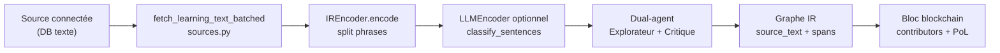
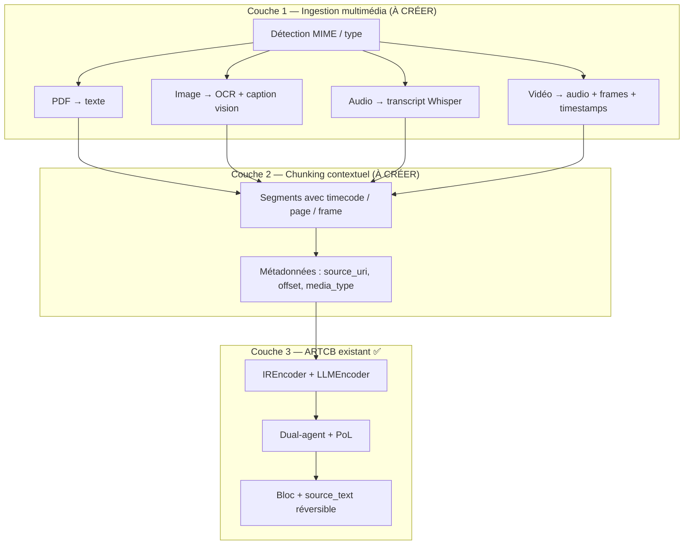

# Rapport 061 — Où sont les rapports 59/60 + sources multimodales (images, audio, vidéo)

**Horodatage :** 2026-07-09T00:05:00Z  
**Contact :** vgacofficiel@gmail.com  
**Références relues :** `PROTOCOLE_ARTCB`, `AUTO_PROMPT_ARTCB`, `CAHIER_DES_CHARGES_ARTCB` v1.3, `rapports/057`, `rapports/059`, `rapports/060`  
**Progression formats multimodaux :** **~15 %** (texte + PDF démo seulement) | **Progression connecteurs DB texte :** **~85 %**

---

## 0. OÙ SONT LES RAPPORTS 59 ET 60 ? — ILS EXISTENT

### Les fichiers sont dans le dépôt Git, dossier `rapports/`

| Rapport | Chemin exact dans le repo | Commit `main` |
|---------|---------------------------|---------------|
| **059** | `rapports/059_minage_prive_multi_mineurs_securite.md` | `605fbd4` |
| **060** | `rapports/060_validation_minage_prive_git_et_securite.md` | `5bc448d` |
| **061** (ce fichier) | `rapports/061_sources_multimodales_apprentissage_formats.md` | à pousser |

### Si vous ne les voyez pas sur votre PC — cause la plus fréquente : pas de `git pull`

```bash
cd ~/ARTCB/lvx
git fetch origin main
git checkout main
git pull origin main
git log -1 --oneline
# Attendu : 5bc448d ou plus récent (avec rapport 061 après push)

ls -la rapports/059*.md rapports/060*.md rapports/061*.md
```

### Vérification sur GitHub (navigateur)

URL directe (branche `main`) :

- https://github.com/vgac2025/lvx/blob/main/rapports/059_minage_prive_multi_mineurs_securite.md
- https://github.com/vgac2025/lvx/blob/main/rapports/060_validation_minage_prive_git_et_securite.md

**Navigation :** repo `vgac2025/lvx` → dossier `rapports/` → trier par nom (059, 060…).

### Si `ls` ne montre toujours rien après `git pull`

| Cause possible | Solution |
|----------------|----------|
| Mauvais dossier (`~/ARTCB` vs clone ailleurs) | `pwd` doit être `…/lvx` |
| Branche pas sur `main` | `git branch` → `git checkout main` |
| Clone ancien / fork | `git remote -v` doit pointer vers `vgac2025/lvx` |
| HEAD en retard | `git rev-parse HEAD` vs `git rev-parse origin/main` |

---

## 1. Réponse courte — Images, audio, vidéo aujourd'hui

| Type de source | Appris correctement aujourd'hui ? | Détail |
|----------------|-----------------------------------|--------|
| **Texte** (DB colonne `content`, JSON texte) | **✅ Oui** | Pipeline complet |
| **PDF** (texte extractible) | **⚠️ Partiel** | Code `pdf_loader.py` existe — **pas** branché sur Intégrations |
| **Images** (JPG, PNG, etc.) | **❌ Non** | Pas d'OCR ni vision dans le pipeline connecteurs |
| **Audio** (MP3, WAV, etc.) | **❌ Non** | Pas de transcription (Whisper, etc.) |
| **Vidéo** (MP4, etc.) | **❌ Non** | Pas d'extraction audio/sous-titres/frames |
| **Binaire brut en DB** (blob image) | **❌ Non** | Sérialisé en JSON = inutilisable pour l'IR |
| **Office** (DOCX, XLSX) | **❌ Non** | Pas de parseur dédié |
| **URL / site web** | **❌ Non** | Pas de connecteur fetch HTML |

**Principe ARTCB actuel :** tout passe par une chaîne **texte → phrases → graphe IR → raisonnement PoL → bloc**. Sans texte (ou transcription/description), **pas d'apprentissage réel**.

---

## 2. Comment ça marche aujourd'hui (texte uniquement)



### Fichiers clés (preuve code)

| Fichier | Rôle | Limite |
|---------|------|--------|
| `src/artcb/connectors/sources.py` | Lit **texte** depuis Supabase/SQLite/Postgres/MySQL | Pas de binaire média |
| `src/artcb/ir/encoder.py` L1 | « Encodage **texte** humain → graphe IR » | `encode(text: str)` |
| `src/artcb/ir/llm_encoder.py` | Enrichit via LLM sur **phrases** | Pas de vision/audio API |
| `src/artcb/connectors/llm_router.py` | OpenAI, Anthropic, Bob — **chat texte** | Pas multimodal |
| `src/artcb/mining/pipeline.py` | `run_from_text(text: str)` | Entrée = string |
| `src/artcb/io/pdf_loader.py` | Extraction texte PDF | Utilisé démo API, **pas** connecteur UI |
| `frontend/src/pages/Integrations.tsx` | UI connecteurs | DB texte seulement |

### Connecteurs sources actuellement supportés

```python
# src/artcb/connectors/manager.py L29
DATA_SOURCE_PROVIDERS = {"supabase", "postgres", "mysql", "sqlite"}
```

**Pas de :** `local_folder`, `s3`, `gcs`, `youtube`, `rss`, `notion`, etc.

---

## 3. Que se passe-t-il si l'utilisateur connecte des images / audio / vidéo ?

### Scénario A — Images dans une table SQL (colonne BLOB ou URL)

1. Le connecteur lit la ligne via SQL/REST.
2. `_rows_to_text()` fait `json.dumps(row)` → l'image devient une **chaîne base64 ou un chemin**, pas du sens.
3. L'encodeur IR découpe ce « texte » en pseudo-phrases.
4. **Résultat :** graphe IR **sans compréhension** du contenu visuel — contexte perdu, PoL sur du bruit.

### Scénario B — Fichiers images dans un dossier local

- **Aucun connecteur** ne scanne un dossier de fichiers aujourd'hui.
- L'utilisateur ne peut pas les sélectionner dans **Intégrations**.

### Scénario C — Audio / vidéo

- Même constat : sans couche **speech-to-text** + éventuellement **description visuelle**, ARTCB ne peut pas mémoriser le contenu sémantique.
- Le graphe IR exige `source_text` réversible (voir `IRGraph.source_text`, spans `start`/`end`).

### Scénario D — PDF (cas particulier)

- **Possible** si le PDF contient du texte extractible (pas scan image seul).
- Code existant : `extract_pdf_text()` dans `src/artcb/io/pdf_loader.py`.
- **Mais** : pas exposé comme connecteur dans `/integrations` — seulement route démo `GET /demo/wailly-excerpt` (`src/api/routes.py`).

---

## 4. Matrice complète — formats externes

| Format | État code | Possible sans dev ? | Envisageable | Comment l'implémenter |
|--------|-----------|---------------------|--------------|----------------------|
| Texte brut / UTF-8 | ✅ | Oui | — | Déjà fait |
| JSON / CSV texte en DB | ✅ | Oui (colonne texte) | — | `text_column` config |
| HTML / Markdown fichiers | ❌ | Non | ✅ P1 | Connecteur `local_folder` + parseur |
| PDF texte | ⚠️ code hors UI | Via script manuel | ✅ P0 | Connecteur `pdf` + `pdf_loader` |
| PDF scan (image) | ❌ | Non | ✅ P1 | OCR (Tesseract) ou Vision API |
| Images JPG/PNG/WebP | ❌ | Non | ✅ P1 | OCR + Vision LLM (GPT-4o, Claude vision) |
| Audio MP3/WAV/OGG | ❌ | Non | ✅ P1 | Whisper local ou API |
| Vidéo MP4/MKV | ❌ | Non | ✅ P2 | ffmpeg → audio (Whisper) + keyframes (vision) |
| Sous-titres SRT/VTT | ❌ | Non | ✅ P1 | Parseur direct → texte |
| DOCX / ODT | ❌ | Non | ✅ P2 | python-docx / pandoc |
| XLSX / CSV fichier | ❌ | Non | ✅ P2 | openpyxl / pandas |
| EPUB | ❌ | Non | ✅ P2 | ebooklib |
| URL web | ❌ | Non | ✅ P2 | httpx + readability |
| YouTube / podcast RSS | ❌ | Non | ✅ P3 | yt-dlp + transcript API |
| BLOB binaire DB | ❌ | Non | ✅ P2 | Détecter MIME → routeur média |
| Modèles 3D, CAD | ❌ | Non | ⚠️ P3 | Description texte via LLM — recherche |

---

## 5. Architecture cible — préserver le contexte ARTCB

Objectif : convertir tout média en **texte structuré + métadonnées de provenance**, puis réutiliser le pipeline IR existant **sans perdre le contexte**.



### Extensions IR proposées (sans casser v0.1)

| Champ | Où | Rôle |
|-------|-----|------|
| `media_type` | métadonnée nœud ou graphe | `text`, `image_caption`, `audio_transcript`, `video_segment` |
| `source_uri` | graphe | `file:///…`, `s3://…`, `row_id` |
| `time_start` / `time_end` | nœud | sync audio/vidéo |
| `page` | nœud | PDF |
| `content_hash` | nœud | SHA3 du média original (preuve, pas le binaire on-chain) |
| `parent_graph_id` | graphe | lier segments d'une même vidéo |

Le `source_text` reste le **transcript/caption concaténé** — réversibilité textuelle conservée. Les médias originaux restent **hors chaîne** (fichiers locaux ou stockage client), seuls hash + texte dérivé sont minés.

---

## 6. Plan d'implémentation proposé (validation GO requise)

### Phase M0 — PDF connecteur (rapide, code déjà là)

1. Provider `pdf` ou `local_folder` avec filtre `*.pdf`
2. Réutiliser `extract_pdf_text` / `extract_pdf_chunks`
3. UI Intégrations : chemin fichier + bouton Apprendre
4. **Effort :** faible | **Priorité :** P0

### Phase M1 — Images + audio

1. Module `src/artcb/io/media_ingest.py`
2. Images : Tesseract OCR (local) **ou** OpenAI/Claude vision (cloud, opt-in)
3. Audio : `faster-whisper` (local) **ou** OpenAI Whisper API
4. Connecteur `local_folder` : scan récursif par extensions
5. **Effort :** moyen | **Priorité :** P1

### Phase M2 — Vidéo + documents Office

1. `ffmpeg` extrait piste audio + 1 frame / N secondes
2. Pipeline : transcript + descriptions frames horodatées
3. DOCX/XLSX via parseurs Python
4. **Effort :** moyen-élevé | **Priorité :** P2

### Phase M3 — Sources cloud

1. S3 / GCS / Azure Blob (lecture seule, clés utilisateur)
2. URL + RSS
3. **Effort :** élevé | **Priorité :** P2–P3

### Dépendances Python suggérées (optionnelles, extras `[media]`)

```
pypdf          # déjà présent
python-magic   # MIME
pytesseract    # OCR local
faster-whisper # STT local
ffmpeg-python  # vidéo
python-docx
openpyxl
```

---

## 7. Sécurité et confidentialité par type

| Type | Risque si cloud | Recommandation secteur sensible |
|------|-----------------|--------------------------------|
| Image OCR local | Faible | Tesseract on-prem |
| Image vision API | Image envoyée au fournisseur | Interdit banque → OCR local seulement |
| Audio Whisper API | Audio envoyé cloud | `faster-whisper` local |
| Vidéo | Audio + frames vers cloud | Pipeline 100 % local ou air-gapped |
| PDF | Texte seulement en local | OK |
| BLOB DB | Fuite si dump JSON | Ne jamais sérialiser binaire — convertir d'abord |

**Règle alignée PROTOCOLE :** le minage privé reste local ; seuls les appels **opt-in** vers API IA externes transitent vers le fournisseur choisi par l'utilisateur.

---

## 8. Checklist validation — que voulez-vous en priorité ?

| # | Fonctionnalité | État | GO ? |
|---|----------------|------|------|
| M0 | Connecteur **PDF** dans Intégrations | Code partiel | ☐ |
| M1 | Connecteur **dossier local** (txt, md, pdf) | Non | ☐ |
| M1 | **Images** — OCR local Tesseract | Non | ☐ |
| M1 | **Images** — Vision API (GPT-4o / Claude) | Non | ☐ |
| M1 | **Audio** — Whisper local | Non | ☐ |
| M1 | **Audio** — Whisper API | Non | ☐ |
| M2 | **Vidéo** — transcript + segments | Non | ☐ |
| M2 | DOCX / XLSX | Non | ☐ |
| M2 | Métadonnées IR `media_type`, timecodes | Non | ☐ |
| M3 | S3 / URL / YouTube | Non | ☐ |

---

## 9. Avant / après — clarifications

| Sujet | Erreur fréquente | Vérité code |
|-------|------------------|------------|
| Rapports 59/60 | « Pas créés » | **Créés** dans `rapports/` sur `main` — faire `git pull` |
| Images en DB | « ARTCB apprend l'image » | **Non** — JSON texte sans vision |
| Audio connecté | « Transcrit automatiquement » | **Non** — pas de STT |
| Vidéo | « Analysée » | **Non** |
| PDF | « Pas supporté » | **Code existe** — pas dans UI Intégrations |
| Contexte | « Perdu » si on ajoute média | **Évitable** — timestamps + `source_text` segmenté |
| Tout format | « Impossible » | **Envisageable** — couche ingestion avant IR |

---

## 10. Recommandation VGACTech

| Priorité | Action |
|----------|--------|
| **P0** | Connecteur PDF + dossier texte dans Intégrations |
| **P1** | Pipeline ingestion `media_ingest.py` (OCR + Whisper local) |
| **P1** | Extension métadonnées graphe pour timecodes / provenance |
| **P2** | Vidéo + Office |
| **P2** | Vision API opt-in (cloud) avec avertissement UI |

**Aucun développement sans vos cases cochées §8.**

---

## 11. Fichiers source cités

| Fichier | Lignes / rôle |
|---------|---------------|
| `src/artcb/connectors/sources.py` | L33–64 — fetch texte DB uniquement |
| `src/artcb/connectors/manager.py` | L29 — `DATA_SOURCE_PROVIDERS` |
| `src/artcb/ir/encoder.py` | L1, L44 — `encode(text: str)` |
| `src/artcb/ir/models.py` | L44–53 — `IRGraph.source_text` |
| `src/artcb/io/pdf_loader.py` | PDF → texte (hors connecteurs) |
| `src/artcb/mining/pipeline.py` | L97–132 — `run_from_text` |
| `frontend/src/pages/Integrations.tsx` | L27–32 — providers UI |

---

**© 2026 VGACTech — vgacofficiel@gmail.com**

*Rapport 061 — localisation rapports 59/60 + état réel formats multimédias.*
