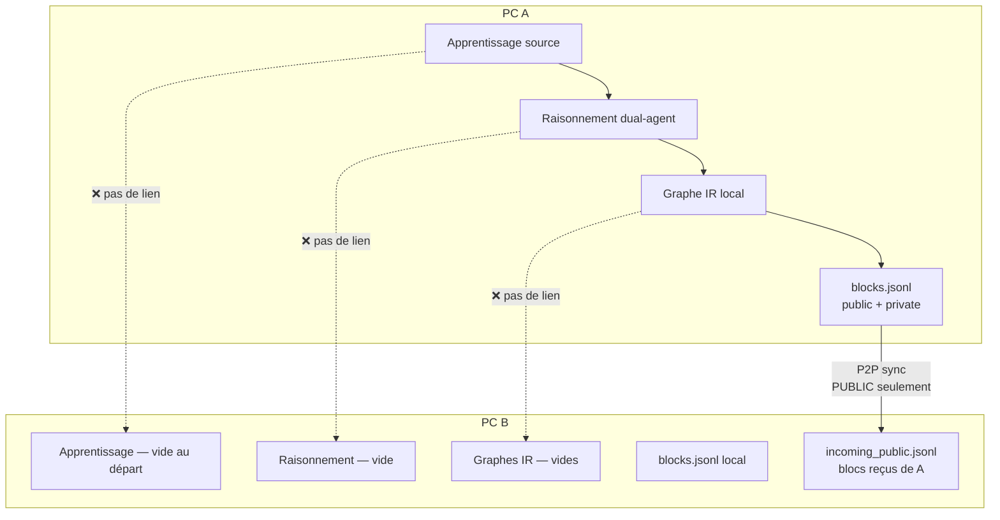

# Rapport 064 — 2 PC connectés : apprentissage/raisonnement partagés ou pas ? (TEST RÉEL)

**Horodatage :** 2026-07-09T01:00:00Z  
**Contact :** vgacofficiel@gmail.com  
**Machine test :** VM Cloud Agent (Cursor) — **PAS votre PC physique**  
**Script :** `scripts/validate_two_nodes.py --spawn`  
**Log :** `logs/validate_two_nodes_latest.json`  
**Résultat :** **10/10 étapes OK** ✅

---

## 1. RÉPONSE DIRECTE À VOTRE QUESTION

### Si vous installez le dépôt sur **2 PC** et vous connectez en P2P :

| Activité | Partagée entre les 2 PC ? |
|----------|---------------------------|
| **Minage d'apprentissage** (lecture source, IR) | **NON** |
| **Minage de raisonnement** (Explorateur + Critique + PoL) | **NON** |
| **Calcul GPU/CPU** (LLM, OCR, Whisper…) | **NON** |
| **Graphes IR** (`data/graphs/`) | **NON** |
| **Blocs `private`** | **NON** |
| **Blocs `public`** (métadonnées : hash, PoL, graph_root) | **OUI** — via sync P2P |
| **Reward ARTCB** sur bloc public | Visible sur B en **archive** P2P |

### En une phrase

> **Chaque PC fait tout le travail d'apprentissage et de raisonnement sur SA machine.**  
> Le réseau ne partage que les **résultats publics** (blocs `visibility: public`), pas le calcul.

Ce n'est **pas** comme un pool Bitcoin où d'autres machines calculent pour vous.

---

## 2. PREUVE — test exécuté sur 2 nœuds réels (VM)

### Configuration (simule 2 PC)

| Nœud | Port API | Données |
|------|----------|---------|
| **PC A** (simulé) | `18001` | `/tmp/artcb_validate_node_a/data/` |
| **PC B** (simulé) | `18002` | `/tmp/artcb_validate_node_b/data/` |

Deux processus `uvicorn` séparés, deux `ARTCB_DATA_DIR` différents — comme deux installations GitHub sur deux machines.

### Étapes exécutées

```
✓ A — création wallet
✓ A — agents/run (apprentissage + raisonnement LOCAL)
✓ A — store bloc PUBLIC
✓ A — store bloc PRIVATE
✓ B — démarre VIDE (0 bloc, 0 graphe)
✓ B — ajoute A comme pair P2P (clé ML-KEM)
✓ B — sync P2P
✓ B — reçoit blocs publics dans incoming_public.jsonl
✓ B — graphe IR de A : 404 NOT FOUND (pas partagé)
✓ B — aucun bloc private reçu
```

### Conclusions enregistrées (log JSON)

```json
{
  "learning_reasoning_shared_between_pcs": false,
  "mining_compute_shared_between_pcs": false,
  "public_blocks_synced_via_p2p": true,
  "private_blocks_synced": false,
  "ir_graphs_synced": false
}
```

---

## 3. Schéma — ce qui se passe sur 2 PC



---

## 4. VM Cloud Agent vs vos PC réels — différence importante

| | VM test (ce rapport) | Vos 2 PC manuels |
|--|---------------------|------------------|
| **Qui exécute** | Agent Cursor sur serveur cloud | Vous chez vous |
| **IP** | `127.0.0.1` (même machine, 2 ports) | IP LAN réelle (`192.168.x.x`) |
| **Commande** | `python3 scripts/validate_two_nodes.py --spawn` | Voir §5 |
| **Validité** | Prouve la **logique** du code | Prouve **votre** réseau domestique/pro |

**Le code est le même.** Sur vos PC, remplacez `127.0.0.1` par l'IP du PC A dans l'UI **Réseau P2P**.

---

## 5. Reproduire sur VOS 2 PC (manuel réel)

### PC A (192.168.1.10 exemple)

```bash
git clone https://github.com/vgac2025/lvx.git && cd lvx
export ARTCB_WALLET_PASSPHRASE="phrase_min_12_caracteres"
pip install -e ".[connectors,media,dev]"
export ARTCB_DATA_DIR=~/artcb_node_a/data
uvicorn src.api.main:app --host 0.0.0.0 --port 8000
```

Dashboard : `http://192.168.1.10:5173` (ou tunnel)  
→ Mémoriser / Miner → Graver avec **visibility: public**  
→ **Réseau P2P** → copier **clé ML-KEM publique**

### PC B (192.168.1.20)

```bash
# même install
export ARTCB_DATA_DIR=~/artcb_node_b/data
uvicorn src.api.main:app --host 0.0.0.0 --port 8000
```

→ **Réseau P2P** → Ajouter pair : host `192.168.1.10`, port `8000`, clé ML-KEM de A  
→ **Synchroniser**

### Résultat attendu (identique au test VM)

- B reçoit les blocs **public** de A dans `incoming_public`
- B **ne voit pas** les graphes IR de A
- B **ne reçoit pas** les blocs private de A
- L'apprentissage sur B reste **local** jusqu'à ce que vous lanciez vous-même une source sur B

---

## 6. Pourquoi ce n'est pas « 100 % pool partagé » — et ce que « 100 % » veut dire

Vous codez pour que le **système complet** fonctionne sur chaque PC :

| Module | Fonctionnel par PC ? | Partagé entre PC ? |
|--------|---------------------|-------------------|
| Wallet + PQC | ✅ | Non (normal) |
| Apprentissage multimodal | ✅ | Non |
| Raisonnement PoL | ✅ | Non |
| Minage + rewards | ✅ | Non (chaîne locale) |
| P2P blocs publics | ✅ | Oui (métadonnées) |
| ML-KEM transport | ✅ | Oui (push chiffré) |
| Telegram alertes | ✅ | Par canal configuré |
| Gouvernance vote | ✅ | Propositions via API locale |

**« 100 % fonctionnel »** = chaque module marche sur **chaque nœud**.  
**≠** « un PC fait le travail des deux ».

---

## 7. Si vous voulez que l'apprentissage/raisonnement SOIT partagé

C'est un **autre produit** — pas encore codé. Il faudrait :

1. Protocole `MiningJob` (morceaux de graphe)
2. Workers pairs opt-in
3. Preuves signées → `contributors[]`
4. **Interdiction** envoi clair pour données `private`
5. libp2p ou job queue dédiée

**GO explicite requis** — avec acceptation des risques sécurité (fuite données).

---

## 8. Commande de validation (réutilisable)

```bash
cd lvx
export ARTCB_WALLET_PASSPHRASE="phrase_min_12_caracteres"
python3 scripts/validate_two_nodes.py --spawn
cat logs/validate_two_nodes_latest.json
```

Attendu : toutes les étapes `ok: true`, `learning_reasoning_shared_between_pcs: false`.

---

## 9. Avant / après — clarification projet

| Croyance | Réalité testée |
|----------|----------------|
| « 2 PC = ils minent ensemble mon apprentissage » | **Faux** |
| « 2 PC = ils partagent la chaîne complète » | **Faux** — archive public seulement |
| « 2 PC = P2P sync les blocs publics » | **Vrai** |
| « Private sync automatique » | **Faux** — jamais |
| « VM test = même code que PC réel » | **Vrai** — IP/host différent |

---

**© 2026 VGACTech — vgacofficiel@gmail.com**

*Rapport 064 — test réel 2 nœuds, log `validate_two_nodes_latest.json`.*
